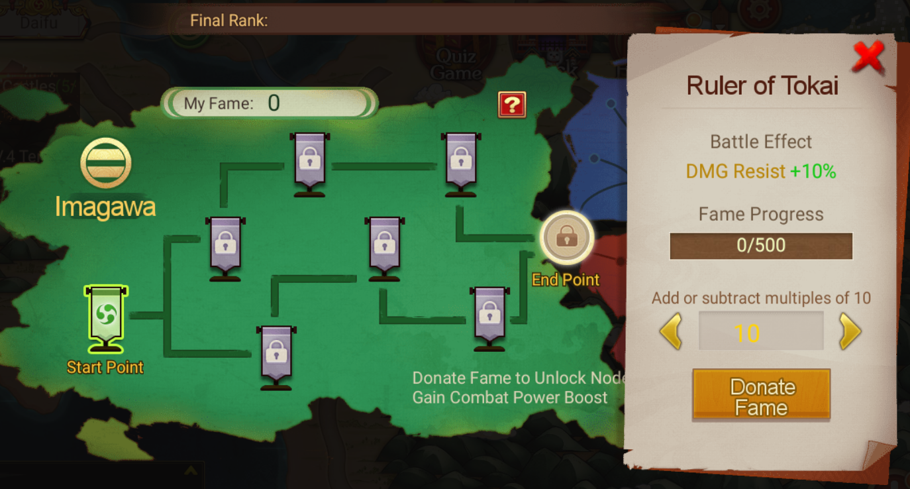

- Alliance of Zentoku Temple: This is a new game mode in the Rashomon event. Players are split into Takeda, Imagawa, or Hojo factions. Through battling, they earn Fame which can be donated within their own faction to unlock key nodes and increase the faction's overall strength. The faction that first achieves their alliance goal gets an extra power boost.
- Fame: Players earn Fame through active participation in battles. These points can be used to unlock bonus Buff rewards on the Fame Track.
	- Use Stratagem: 5 Fame/Stratagem
	- Eliminate Troops: 10 Fame/10,000 Troops
	- Win Battle: 10 Fame/Battle
	- Defeat Player: 50 Fame/Player
- Fame Track: This is a shared reward pathway for players within the same faction. With multiple branching paths, each with a variety of nodes, players unlock rewards by contributing Fame at different nodes. The Fame needed to unlock each node is cumulatively pooled by the entire faction, and the rewards unlocked are shared amongst all members of the faction.
- {:height 399, :width 721}
- Unlock Rewards: There are two types of rewards - battle rewards, and Ghost Amulet rewards.
	- The battle rewards boost your power Buff, varying based on your faction and node.
	- The Ghost Amulet rewards are split into faction and individual rewards, each capped at a maximum of 10 Ghost Amulet.
- Faction Rewards: All players in the first, second, and third factions to reach the main track's peak are rewarded with 5, 3, and 2 Ghost Amulets respectively. Moreover, for *each node unlocked*, the faction's players earn *1 Ghost Amulet*, all contributing towards a shared *maximum of 10 Ghost Amulets* for faction rewards.
	- | Fame Track Completion | Rewarded Ghost Amulet |
	  | --- | --- |
	  | 1st | 5 |
	  | 2nd | 3 |
	  | 3rd | 2 |
- Individual Rewards: Players receive 1 Ghost Amulet for every 50 Fame they donate, up to a cap of *10 Ghost Amulets*.