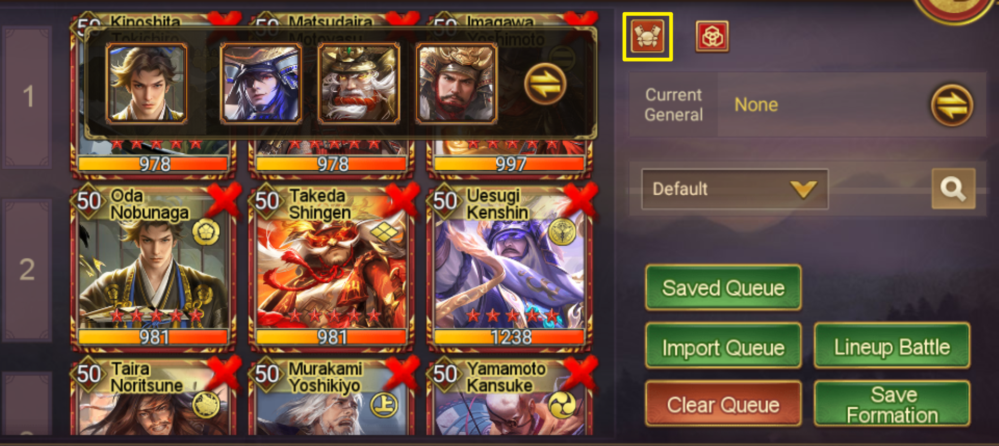

category:: [[Hero Team]]

- ### Overview
- In Sengoku Fubu, players have the option to form a Hero Team for a single Hero by equipping Backup Heroes. A Backup Hero is essentially any other hero owned by the player. Any hero can be assigned as a backup for another, who is referred to as the Main Hero. Once a hero is designated as a backup, they don't participate directly in battles but instead contribute by enhancing the stats and activate combos for all allied Heroes on the battlefield.
- ### Deployment of Backup Heroes
- **Limitation**: The Main Hero must be a non-Staff and non-Supporter Hero with a rarity of SSR or above.
	- DONE #[[Known Issue]] No notes in game to clarify the Hero with rarity SR and below can't equip Backup Hero.
	  :LOGBOOK:
	  CLOCK: [2023-11-30 Thu 14:30:00]--[2023-12-21 Thu 13:00:32] =>  502:30:32
	  :END:
	- DONE #[[Known Issue]] The option to equip a Backup Hero for an SR Hero or below still exists in the interface; it hasn't been taken away.
	  :LOGBOOK:
	  CLOCK: [2023-11-30 Thu 14:30:00]--[2023-12-01 Fri 16:50:00] =>  26:20:00
	  :END:
	- DONE #[[Known Issue]] Currently a Hero can be added as Staff and Backup Hero at the same time. It will be fixed in future update.
	  :LOGBOOK:
	  CLOCK: [2023-11-30 Thu 14:30:00]--[2023-12-21 Thu 13:00:30] =>  502:30:30
	  :END:
- **Capacity**: Each Main hero can be linked with up to three Backup Heroes.
- **Exclusivity**: A Hero can only serve as a Backup Hero for one Main Hero. A Hero can't be Backup Hero and Supporter at the same time. Only Hero without Supporter can be Backup Hero.
- ### Impact on Combat
- **Stats Boost**: Backup Heroes contribute to the power of all allied Heroes during combat by boosting their stats (only Physical Attack, Physical Defense, Stratagem Attack, and Stratagem Defense).
	- Backup Hero's Shadow and Troop Gear will not benefit allied Heroes.
- **Combo Skills**: Backup Heroes can trigger combo skills that enhance basic stats, benefiting all allies on the battlefield. However, the effects of these combos are less potent compared to direct participation. Notably, combos that involve 1 Ougi Skill or involve troops being defeated are not possible with backup heroes.
- **Effectiveness in Battle**: In standard battles, which exclude specific modes like Tenka Fubu or battles using War Drums, only the Backup Hero of one Main Hero is effective.
- ### Set Backup Hero in Queue
- {:height 333, :width 680}