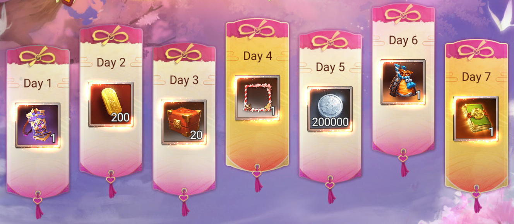
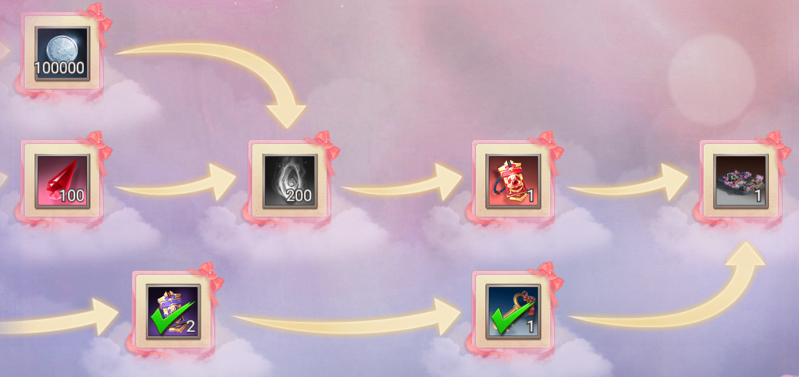
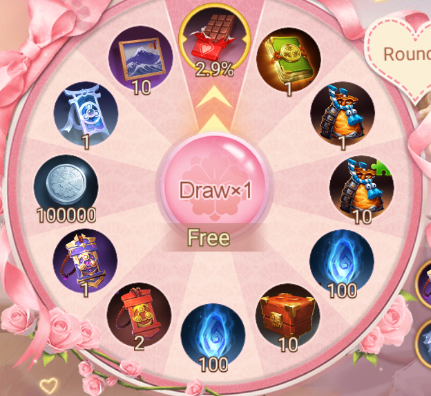
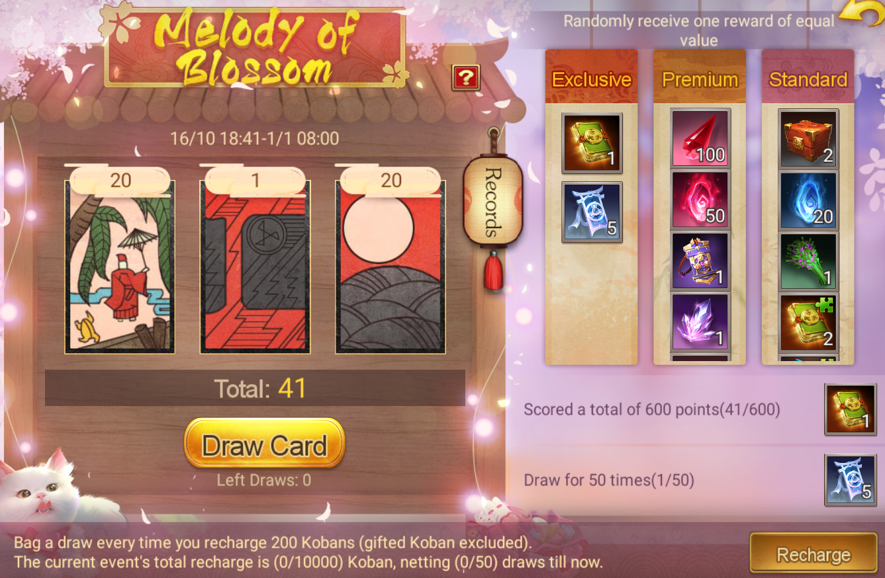
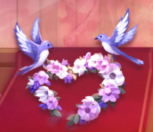
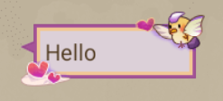
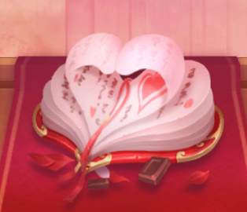
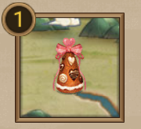
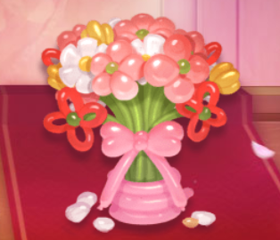

category:: [[Festival]]

- Event Time: [[Feb 5th, 2024]] 1AM - [[Feb 25th, 2024]] 2:59PM
- **7-Day Login Bonus**
	- {:height 295, :width 649}
- **Limited Recruitment —** [[Valentine's Day]]
	- [[Suzuki Shigetomo, Valentine's Day 2024]]
	- [[Suzuki Shigehide, Valentine's Day 2024]]
- **Journey of Gifts —** [[Journey of Love]]
	- Earn points in the game and unlock unique Castle skins on the Journey of Love.
	- {:height 319, :width 651}
- **Wheel Lottery —** [[Valentine's Wheel]]
	- {:height 460, :width 489}
- **Recharge Bonus —** [[Melody of Blossom]]
	- {:height 414, :width 610}
	- During the event, topping up in-game gives you the chance to draw cards.
	- The total score of your drawn cards corresponds to different prize pool.
	- After drawing, you'll receive a random gift from the prize pool that matches your score.
- **Valentine's Pack** #kanban-w200
	- Wing to Wing
		- {:height 113, :width 116}
		- Special Item - Chatting Bubble
		- {:height 94, :width 175}
	- Book of Crush
		- {:height 113, :width 116}
		- Special Item - Flag
		- {:height 124, :width 125}
	- Romantic Balloon
		- {:height 113, :width 116}
		- Special Item - Lord Image
		- Limited Suzuki Shigetomo
- **Special Game Mode —** [[Out of Chaos]] {{embed [[Out of Chaos]] }}
- Schedule
	- Bittersweet Festival
	  DEADLINE: <2024-02-25 Sun>
	  SCHEDULED: <2024-02-05 Mon>