- 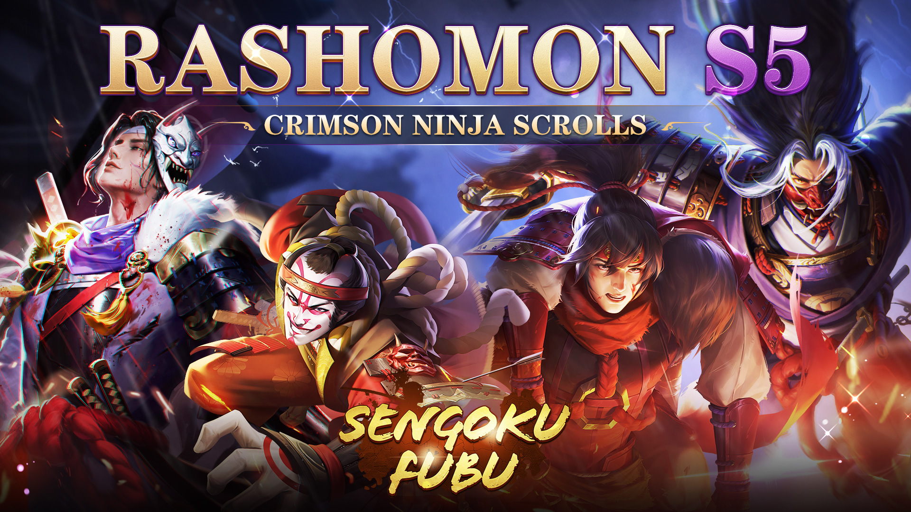
-
	- Crimson Ninja Scrolls is the 5th season of [[Rashomon]]. It starts on [[Jun 30th, 2022]] and ends on [[Oct 30th, 2022]].
	- This is the first time when [[Returning SP Hero Recruitment]] and mini-game [[One Against Many]] have been introduced in game.
	- Same with previous seasons of [[Rashomon]], new [[SP Hero]], [[SP Gear]], [[Troop Gear]], and new gameplay [[My Old Tactics]] in [[Classic Match]] have been added.
	- **[[Returning SP Hero Recruitment]]**
		- Recruitment
			- Use 200 [[Ghost Tear]] or 1 [[SP Recruit Token]] to perform the Returning SP Recruit.
			- 1 free chance is guaranteed each week.
			- Special offer: a 5-time [[Ghost Tear]] recruitment with 50% off is guaranteed each week.
			- Free chance and special offer are reset at 5:00 GMT+9 on Monday.
			- You will obtain [[Ghostfire]] instead of [[Warsoul]] when you recruited an owned Hero.
			- [[Pity System]]
				- 1 [[SP Hero]] is guaranteed on your 50th attempt.
				- Obtaining a [[SP Hero]] within 50 attempts will not reset the pity count.
				- The pity count of Returning SP Hero Recruitment is not shared with SP Hero Recruitment of current theme.
				- Pity count will be reset after the end of [[Rashomon]].
			- Hero Pool
				- There are 3 returning themes for this recruitment. Each week one theme will be activated and SP Heroes featuring this theme will be obtainable.
				- The 3 themes are [[Decisive Battle, Battle of Sekigahara]], [[Guardians of Tokugawa]], [[Siege of Osaka]].
		- Rarity & Recruitment Chance
			- SP Hero: 2%
			- SSR Hero: 2%
			- SR Hero: 10.7%
			- R Hero: 85.3%
		- #+BEGIN_IMPORTANT
		  Ghost, Ghost Tear, and SP Recruit Token will all be kept after the end of current Rashomon. They can still be used in Rashomon with new theme.
		  #+END_IMPORTANT
	- **Mini-Game [[One Against Many]]**
		- 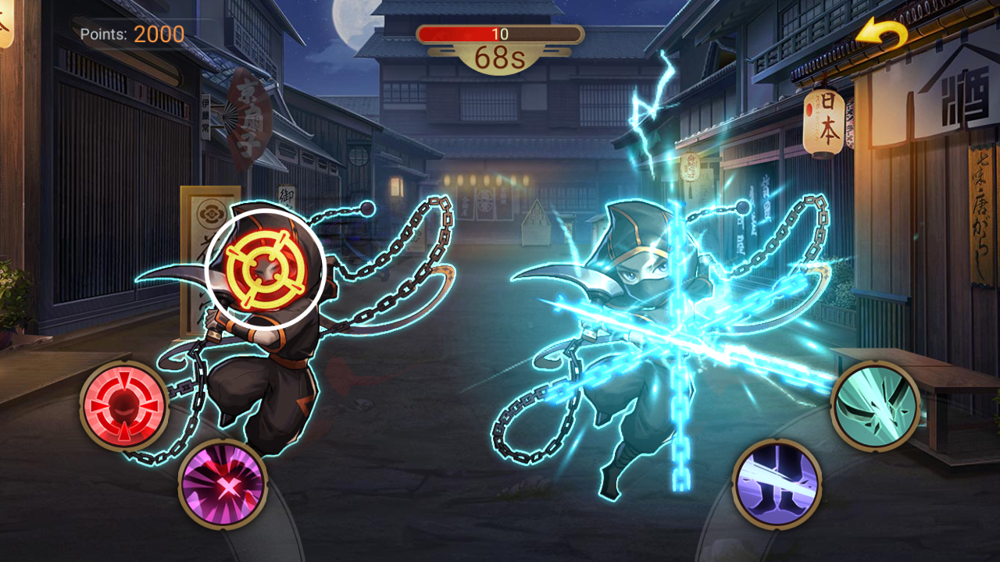
		- This game is a mini-game in Rashomon, where the player appears in the alley as a samurai and has to fight the enemy ninja. Each game lasts **90** seconds.
		- Each enemy ninja will have a marker on different parts of his body to represent his weakness, the player can kill the ninja by clicking on the corresponding button to make the correct move, the killed ninja will disappear.
		- Once the ninja is in front of the player, a circle of weakness and a circle of accuracy will appear on his body. The circle of accuracy will gradually shrink, before it shrinks to coincide with the circle of weakness, kill the ninja to get a "Good" rating; when it shrinks to coincide with the circle of weakness, kill the ninja to get a "Perfect" rating; when it shrinks to less than the circle of weakness, the ninja will deduct 1 point of player's blood and disappear.
		- The player's blood is 20 point and each incorrect move or missed kill deducts 1 point from the player's blood and the game ends immediately when the blood reaches 0.
		- At the end of the game, the total score will be calculated based on the number of kills, Perfect rating, Good rating and the maximum number of consecutive kills, and the corresponding overall rating will be given.
		- +2000 points for each Perfect kill and +1000 points for each Good kill.
		- Maximum hit count of 5/15/25/35/45 will earn you an additional 1000/2000/4000/7000/10000 points respectively, and the hit count will be calculated at the end of mini-game.
		- The final game score is divided into 4 ratings: SS/S/A/B, corresponding to a score range of 0 - 50000, 50001 - 70000, 70001 - 85000, 85001 - 100000 and a bonus of 10/20/30/40 Gold Shards.
		-
	- **New Gamplay in [[Classic Mode]]**
		- [[Castle]]
			- Constructing
				- 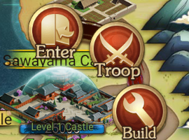
				- Players can build defensive constructions (DC) for the castle. There are 3 kinds of DC, Anti-Cavalry, Trap, and Outpost.
				- Only one DC can be built for a castle at the same time. DC can be discovered through Scout.
				- It requires 20k Coins to construct a DC. DC exists for 1 hour after it has been built and will be demolished automatically after 1 hour.
				- Player can demolish the DC manually and construct another one. Outpost can't be demolished when its effect is activated.
				- DC will be destructed automatically when a castle has been taken by the enemy.
			- Effect
				- All 3 kinds of DC has its own passive effect which is activated immediately when corresponding castle is being attacked.
					- 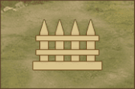
					  Anti-Cavalry: increases enemies' marching time by 5 minutes for corresponding castle.
					- 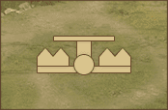
					  Trap: decreases troops by 50% for 1 random Hero from first 6 Heroes of enemies' attack force before the battle starts for corresponding castle.
					- 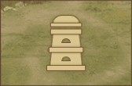
					  Outpost: player will receive part of information of enemies' attack force for corresponding castle.
		- [[My Old Tactics]]
			- "The value of these old tactics is consistent and proven time and time again."
			- 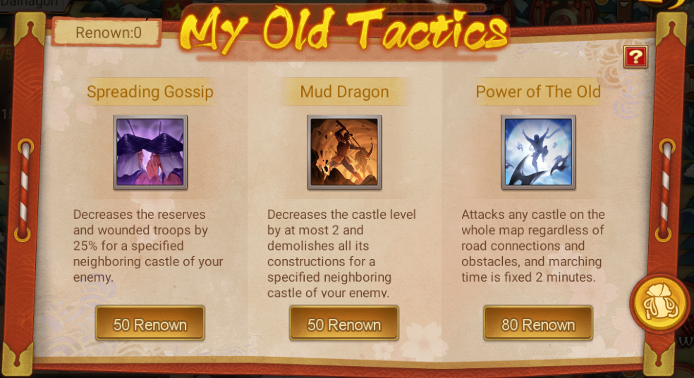
			- Power of Tactics
				- Three different tactics are available in My Old Tactics. Players can exchange Renown for them.
					- 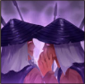 
					  Spreading Gossip: decreases the reserves and wounded troops by 25% for a specified neighboring castle of your enemy.
					- 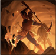 
					  Mud Dragon: decreases the castle level by at most 2 and demolishes all its constructions for a specified neighboring castle of your enemy.
					- 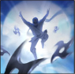 
					  Power of The Old: attacks any castle on the whole map regardless of road connections and obstacles, and marching time is fixed 2 minutes.
						- Attacks any castle on the whole map regardless of road connections and obstacles, and marching time is fixed 2 minutes (Marching Boost can't be used). Owner of the target castle can only receive notice when the left marching time is 1 minute.
						- How to use
							- After tap Use for this tactic, player needs to select an owned castle with deployed Heroes and troops as starting castle, then select the target castle.
			- Obtain Tactics
				- Renown is the new currency for exchanging for tactics. It can be obtained by completing following actions:
					- | Renown Quest | Rewarded Renown |
					  | --- | --- |
					  | Use 1 Stratagem | 5 Renown |
					  | Purchase in Blackmarket for 1 time | 5 Renown |
					  | Enter Secret Room of Blackmarket for 1 time | 50 Renown |
					  | Kill 10k troops | 10 Renown |
					  | Win 1 battle | 10 Renown |
					  | Capture a Castle | 20 Renown |
				- The exchange limit of tactics is shared by players on the whole map. The required exchange Renown increased with the increasing of exchange times.
				- Tactics players obtained from the match will not be kept after the end of current match.
			- Ghost Amulet
				- Players can obtain Ghost Amulet by exchanging for tactics.
				- Ghost Amulets are delivered after the end of current match ==through mail==. At most 10 Ghost Amulets can be obtained from a single match.
				- | Exchanged Tactics | Obtain Ghost Amulet |
				  | --- | --- |
				  | 1 | 2 |
				  | 3 | 5 |
				  | 5 | 3 |
				  | 6 | 1 |
				  | 7 | 1 |
				  | 8 | 1 |
				- 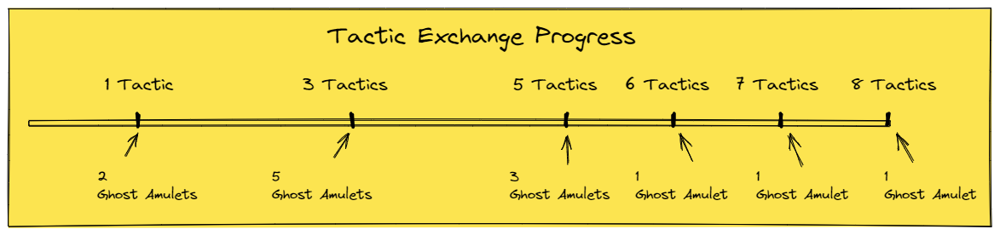