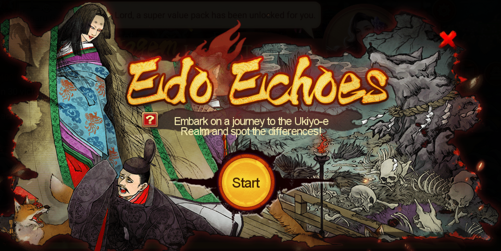
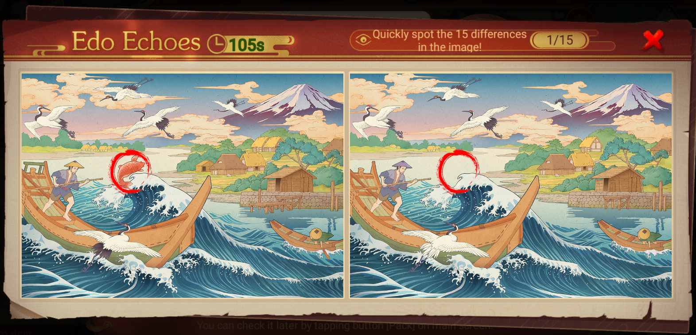

- {:height 346, :width 676}
- Edo Echoes is one of the mini-games that can be encountered in the Classic Match.
- The mini-game will randomly start within *5 hours* after the battle begins and it's limited to refresh *once a day*. If the battle ends too quickly, the mini-game may not have a chance to start.
- Only *one type* of the mini-game will be triggered in the same Classic Match.
- {:height 346, :width 676}
- The goal of the game is to *find the differences* in 2 Ukiyo-e Images. Each game lasts 2 minutes. The countdown starts as you enter the game and exits automatically when time's up.
- Each Ukiyo-e image has *15* set differences. You'll earn matching random resource rewards based on how many differences you spot. Resources like provision and coins are applied instantly, while other rewards are mailed. For instance, if you spot 5 differences, you'll randomly receive 5 rewards from the rewards pool.
- | | **Rewards Pool** | | |
  | --- | --- | --- |
  | Provision x10k | Coin x30k | Silver Chogin x10k | 
  | Provision x20k | Impressment x3 | SSR Hero Pack Shard x5 |
  | Provision x20k | Recruit Token x3 | SSR Gear Pack Shard x10 |
  | Coin x10k | Warsoul x50 | Medick x2 |
  | Coin x20k | Stratagem Pack x3 | Ghost Tears x10 |