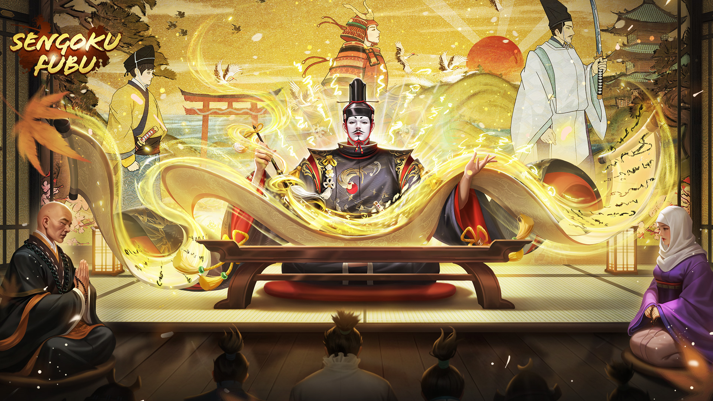

category:: [[Hero]]
launch-date:: 
rarity:: [[SSR]]
edition:: [[Pinnacle Hero]]
classic:: [[Imagawa Yoshimoto]]

- Portrait
	- {:height 1080, :width 1920}
- Ougi Skill — Power in Hand
	- Cost: 2 Ougi
	- Deals 165% Physical Damage to all enemies and applies [[Strong Dispel]] to them. Shields yourself, absorbing damage by 50% of your Physical Attack, applies [[Warding]] (2 mark) on yourself. Applies [[Adversity]] on 2 friendly Heroes with the highest Physical Attack for 3 rounds.
- Talents
	- | Star | Talent |
	  | --- | --- |
	  | ⭐️ | Physical Attack +18% |
	  | ⭐️⭐️ | Crit of Base Attack +45% |
	  | ⭐️⭐️⭐️ | Max Troops +30% |
	  | ⭐️⭐️⭐️⭐️ | Physical Damage +27% |
	  | ⭐️⭐️⭐️⭐️⭐️ | Damage +25% |
- Troop Type
	- [[Ashigaru]]
	- [[Mounted Archery]]
	- [[Lancers]]
	- [[Naginata Infantry]]
	- [[Ichiban-Yari]]
- Breakthru
	- Breakthru Skill
		- Basic Skill ([[Shoshi]])
			- After your own move, Deals 50% Physical Damage to an enemy has the least troops, and applies [[Enfeeble]] to them for 2 rounds. Replenishes troops equal to 10% Physical Attack for 2 friendly Heroes with the highest Physical Attack and applies Pacify to them.
		- Enhanced Skill ([[Chunagon]])
			- When an allied unit loses a positive status, shields 2 friendly Heroes with the highest Physical Attack, absorbing damage by 10% of your Physical Attack, and applies [[Immobility]] on them. Deals 65% Physical Damage to 2 random enemies, applies [[Stagger]] on 2 random enemies for 1 round. Grants a 50% chance to apply [[Sway]] on 2 enemies with the highest stratagem defense for 1 round. (Can trigger 8-time per round)
		- Passive Skill ([[Daishi]])
			- Each time friendly Hero unleashes the Ougi Skill, Ougi Skill Damage Boost +5%. (Stacking up to 6-time)
		- Enhanced Passive Skill ([[Daifu]])
			- Every time when friendly Hero casts an awakening skill, decreases the chance of being parried while attacking +8% (Stacking up to 5-time). Bypass defense by 3% (Stacking up to 6-time).
		- Special Skill ([[Shonagon]])  — Spirit of Imagawa
			- Immune [[Displacement]], while entering the battlefield, applies [[Emanation]] to yourself.
	- Breakthru Stats
		- [[Shoshi]]: Valor+40, Intellect +40 | Aura+40, Might+40
		- [[Daishi]]: Max Troops+150 | Base Attack +20%
		- [[Shonagon]]: Damage +25% | Damage Resist +20%
		- [[Daifu]]: Max Troops + 20% | Physical Damage +20%
		- [[Chunagon]]: Final Damage +15% | Physical & Stratagem Attack +15%