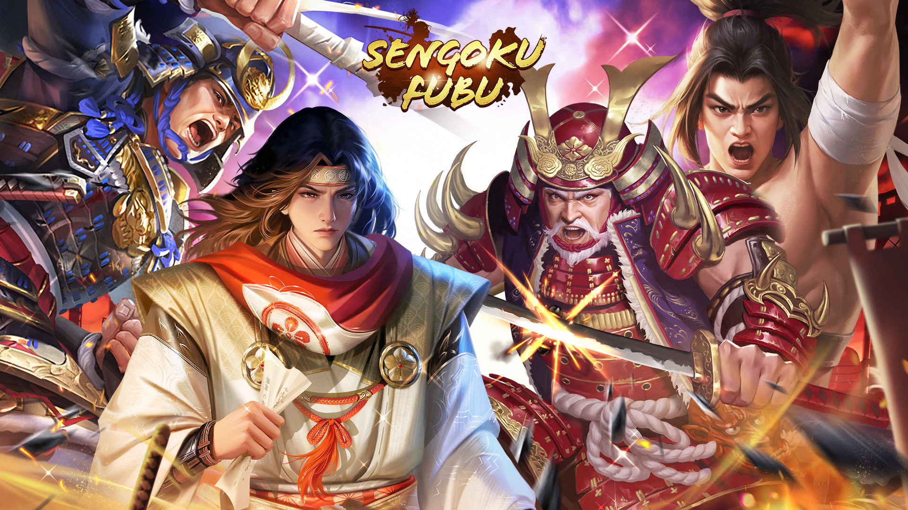

category:: [[Season]]

- Schedule
  collapsed:: true
	- S9
	  DEADLINE: <2024-03-12 Tue>
	  SCHEDULED: <2024-01-11 Thu>
- The Elite Four of Takeda is the 9th season of [[Rashomon]]. It starts on [[Jan 11th, 2024]] and ends on [[May 12th, 2024]].
- Same with previous seasons of [[Rashomon]], new [[SP Hero]], [[SP Gear]], [[Troop Gear]], and new gameplay [[Alliance of Zentoku Temple]] in [[Classic Match]] have been added.
- [[Alliance of Zentoku Temple]], New Gameplay in [[Classic Match]] {{embed [[Alliance of Zentoku Temple]]}}
- New SP Heroes
	- 
	- [[Baba Nobufusa, The Elite Four of Takeda]]
		- #[[Exclusive Weapon]] [[Demon Mino Tachi]]
	- [[Yamagata Masakage, The Elite Four of Takeda]]
		- #[[Exclusive Weapon]] [[Secret Letter]]
	- [[Naito Masatoyo, The Elite Four of Takeda]]
		- #[[Exclusive Weapon]] [[War Drumsticks]]
	- [[Kosaka Masanobu, The Elite Four of Takeda]]
		- #[[Exclusive Weapon]] [[Spear of Defense]]
- New SP Gears
	- #[[Heritage Armour]] {{embed [[[Ghost] Turtle Shell Pattern Armor]] }}
	- #[[Glorious Steed]] {{embed [[[Ghost Life] Hundred Steps]] }}
- Rashomon [[Battlepass]] [[Redemption]] is started at the same time. Unlock Lv.50 to get the [[The Elite Four of Takeda]] SP Exclusive Weapon Pack.
- New Rewards in Rashomon Charts
	- Top 1000 players will receive [[Lord Image]] - SP Yamagata Masakage after the end of this season.