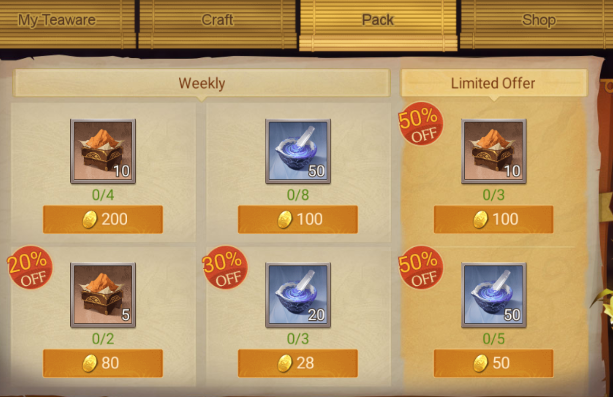
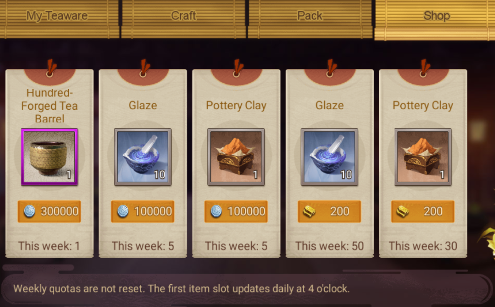
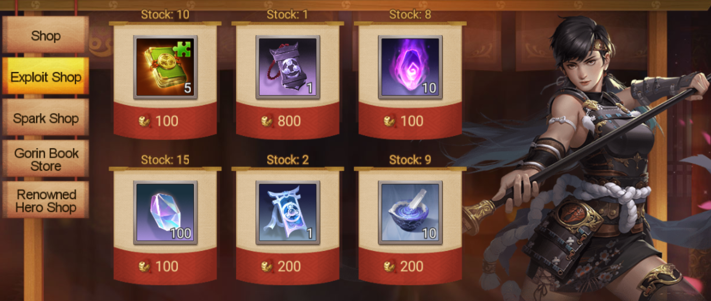

category:: [[Hero Gear]]

- ### Introduction
- Teaware in Sengoku Fubu offers strategic advantages to players by boosting their Hero's abilities. The process of acquiring and upgrading teaware involves several steps and resources.
- ### Getting Teaware
- To craft teaware, players must first acquire [[Pottery Clay]]. This essential resource is available through various means, including:
	- Purchasing from Shop.
	- ~~Completing quests.~~
	- ~~Other in-game activities and sources.~~
	- {:height 362, :width 530}
	- {:height 451, :width 536}
		- #+BEGIN_NOTE
		  The first slot won't update in this week if you have purchased it.
		  #+END_NOTE
- The availability of [[Pottery Clay]] allows players to craft Teaware, which can then be equipped to their Heroes for added benefits.
- ### Upgrading Teaware
- Enhancing the attributes of teaware is a critical aspect of gameplay. This process requires another resource known as [[Glaze]], which can be obtained by:
	- Disenchanting unnecessary or excess Teaware.
	- Purchasing from Shop.
	- ~~Other in-game activities and sources.~~
	- Purchasing from [[Exploit Shop]].
	- {:height 329, :width 732}
- The upgrade levels available for teaware are dependent on the player's [[Title]] within the game. As players progress and attain higher titles, they can access more advanced upgrade options for their teaware.
- | Title | Teaware Level Cap |
  | --- | --- |
  | [[Samurai General]] | 3 |
  | [[Shoshi]] | 5 |
  | [[Daishi]] | 7 |
  | [[Shonagon]] | 9 |
  | [[Daifu]] | 12 |
  | [[Chunagon]] | 16 |
- ### Title Reduction and Its Impact
- A player's in-game [[Title]] influences the effectiveness of their Teaware. If a player's Title is reduced, for any reason, the attributes of the Teaware will be capped at the maximum limit of the new, lower rank. This mechanic adds a layer of strategy to the game, as players must consider the impact of their Title on their equipment.
- ### Unique Attributes of Teaware
- Teaware in Sengoku Fubu comes with distinct attributes that offer various tactical advantages during gameplay. Some of these unique attributes include:
	- **Puncture**: Give a chance to bypass enemy's Parry.
	- **Immunity**: Give a chance to be immune to negative BUFFs induced by enemies.
	- **Physical Piercing**: This allows the Hero to ignore a portion of an enemy's Physical Defense, making attacks more effective.
	- **Stratagem Piercing**: Similar to Physical Piercing, this attribute enables the Hero to ignore a portion of an enemy's Stratagem Defense.