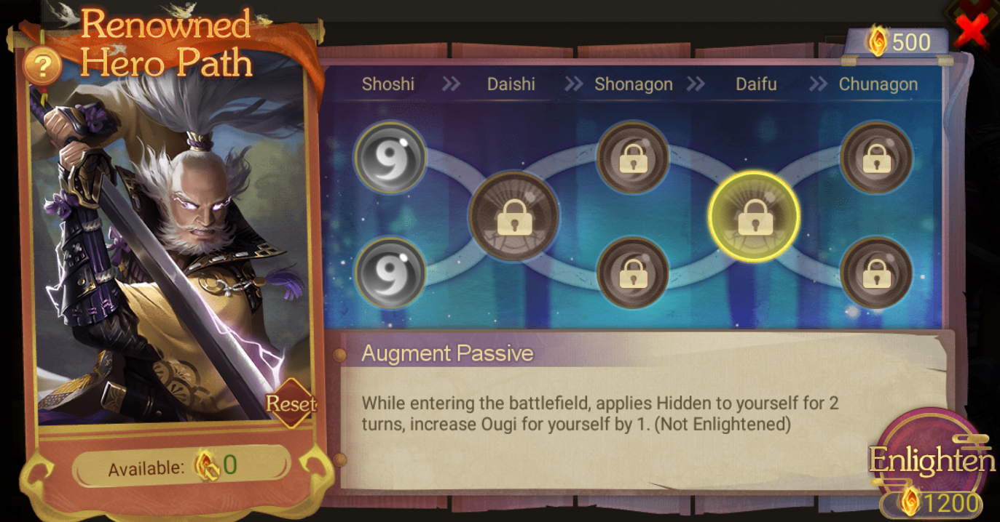

title:: Update Notes ver.1.10.10600
language:: [[en]]
category:: [[Update]]

- #+BEGIN_PINNED
  Patch: Ver.1.10.10600
  Available: 6:30AM UTC on [[Feb 29th, 2024]] 
  #+END_PINNED
- **What's New**
- New [[Mini-Game in Classic Match]]
	- {{embed [[Edo Echoes]]}}
- [[Returning Heroes Limited Edition]]
	- [[Hojo Ujiyasu, Kanto Wars]], [[Uesugi Kenshin, Kanto Wars]], [[Takeda Shingen, Kanto Wars]]
	- {:height 290, :width 673}
- New [[Renowned Hero]]
	- [[Tachibana Dosetsu]] and [[Shima Sakon]]
	- {:height 329, :width 614}
	- {:height 329, :width 614}
	- {:height 329, :width 614}
	- {:height 329, :width 614}
- New [[Exploit Quest]]
	- New Exploits quests unlocked upon reaching specific titles, refreshed weekly on Mondays.
	- {:height 227, :width 530}
	- [[Shonagon]]: Own 2 Castles at level 4 or above
	- [[Daifu]]: Eliminated troops reaching 20k in Classic Match
	- [[Chunagon]]: Eliminated troops reaching 40k in Classic Match
- **Quality of Life Changes**
	- [[Combat Damage]] Boost Adjustment: Damage increases from the 6th round onwards (previously from the 15th round).
	- [[Backpack]] Usage Enhancement: Long-press arrows to adjust item quantities in bulk.
		- {:height 198, :width 172}
	- [[Troop Gear]] Draw Tracking: Guaranteed draw records are now clearly marked.
		- {:height 223, :width 521}
	- [[Blacklist]]: New "Quick Block" feature to instantly block all blacklisted players.
	- [[Troop Gear]] Info: View Troop Gear attributes directly during combat. The Troop Gear info shown represents the highest level gear available for the player's current title.
	- Improved notes for the [[Teaware]] and [[Backup Hero]] systems.
- **Other Fixes and Optimizations**
	- [[Rashomon]] [[Alliance of Zentoku Temple]]
		- Node cost has been reduced, and it's now easier to complete the Fame progress.
	- [[Tenka Fubu]]
		- Players visiting the Tavern as Ronin will have their total points displayed.
	- [[Staff]]
		- You cannot assign Heroes of C, R, or SR rarity as Staff now.