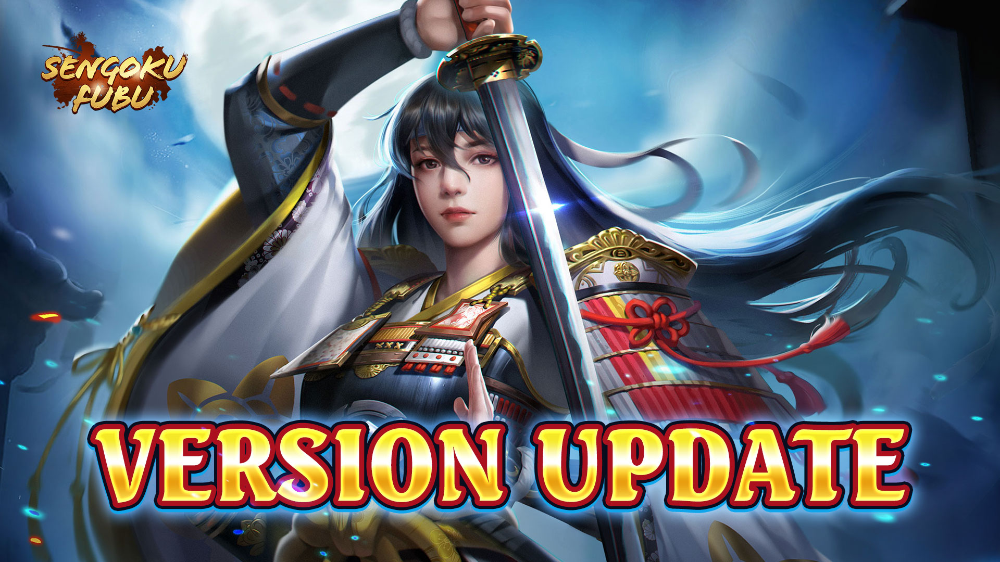

title:: Update Notes ver.1.10.11000
language:: [[en]]
category:: [[Update]]

- #+BEGIN_PINNED
  Patch: Ver.1.10.11000
  Available: 6:30AM UTC on [[Jun 13th, 2024]] 
  #+END_PINNED
- {:height 560, :width 974}
- New [[Renowned Hero]]
	- SSR [[Yamanaka Shikasuke, The Suffering]]
	- SSR [[Shimazu Jisshinsai]]
- [[Exploit Quest]]
	- New [[Premium Exploit Token]] is available
	- #+BEGIN_QUOTE
	  You can only purchase one kind of Exploit Token at the same time
	  #+END_QUOTE
	- Price: 88 Oban
	- Including:
	  600 Koban (immediately)
	  300k Silver Chogin (weekly)
	  7500 Exploit Pts (weekly)
	  25% more Exploit Pts from Exploit Quest
- [[Teaware]]
	- Optimization: The [[Bridge Princess]]'s attribute description has been updated. The [Strengthen Shield] attribute is now [Increase Shield limit].
- [[Ukiyo-e]]
	- Sorting improvement: Selected Binding Heroes will now appear at the top by default.
	- The binding Heroes interface now shows backup or support Heroes (similar functionality to the Heroes overview interface).
- [[Horse Gear Field]]
	- Lv1 rewards adjustment:
	  a. 10 Sinese Roxb changed to 1 Kiso Horse
	  b. 20 Medick changed to 10 Medick
	  c. 5 Sinese Roxb changed to 3 Sinese Roxb
	  d. Find all items in the first level to get an extra 10 Sinese Roxb
- [[Weekly Avtiveness]]
	- Increased rewarded Silver Chogin from Weekly Activeness to 200k (was 100k)
- [[Conqueror Chest]]
	- Increased Silver Chogin rewards for Conqueror Chest:
	  Wooden Chest Silver Chogin increased from 10,000 to 20,000
	  Bronze Chest Silver Chogin increased from 15,000 to 30,000
	  Iron Chest Silver Chogin increased from 30,000 to 50,000
	  Silver Chest Silver Chogin increased from 50,000 to 75,000
	  Golden Chest Silver Chogin increased from 70,000 to 100,000
	  Jadeite Chest Silver Chogin increased from 100,000 to 150,000
- [[Tenka Fubu]]
	- Betting Phase 2 Reward Adjustment
		- The single battle zone betting limit for phase two has been removed. If you guess all advancing players correctly in a battle zone, you'll receive 60 Koban and 15 Merit Chests. If you guess 2 or more advancing players but not all, you'll receive 30 Koban and 10 Merit Chests. (Only one of these rewards can be claimed)
- Hero [[Special Skill]] Enhancements
	- Click the Hero icon during battle to view their Special Skill.
	- Added a filter to select Heroes for Special Skill inheritance.
	- Improved Echo level display.
	- Echo levels now visible when dispatching Heroes.
	- Selecting "All" status for dispatch now shows Heroes and their assigned castles.
	- Attribute panel now shows regular Special Skill attributes.
	- Special Skill interface updated with [Click the icon to view details] prompt.
	- Enhanced text in the Enlightenment interface.
	- Updated Ougi Skill description: [1 Ougi skill] changed to [skill cost 1 Ougi].
	- Battle prompt update: [Miss] changed to [Resist].
- [[Clan]]
	- Added [[Teaware]] display in Clan War.
	- Adjusted Clan mission rewards:
	  a. Allied Unifier: Ally and unify with players from your clan or allied clans, reward: Ghost Tear 200/150 (was Warsoul 200/120).
	  b. Mutual Assistance: Ally with players from your clan or allied clans, reward: Warsoul 300/300 (was Warsoul 100/100).
	- Improved attribute display for Shared Heroes in Clan War to reflect actual stats.
- New [[Staff Skill]] Pack
	- Contents:
	- Staff Skill Designation Token ×3
	- Heartsbane ×3
	- Gorin Book ×20
	- Gorin Log ×30
- [[Under The Sky]]
	- Optimized War Master Trials:
	  Ranking improved: Prioritized by damage, battle start time, and remaining troops.
	- New War Master buffs:
	  Rounds 1-20: No buff;
	  Rounds 21-40: Damage +10%, Damage Resist +10%;
	  Rounds 41-60: Damage +30%, Damage Resist +30%;
	  Round 61+: Damage +50%, Damage Resist +50%.
- [[Pinnacle Hero]]
	- Optimization: Show guaranteed drop information in Pinnacle Hero recruitment records.
	- Pinnacle Arrival improvement: Display the number of Pinnacle Pure Crystals owned by the player on the Pinnacle Arrival interface.
- Other Fixes and Optimizations
	- Battle description interface: Improved Hero equipment screen.
	  Displays current Level, Star, and Awakening status for owned Heroes. Click to enter the Hero screen for upgrades.
	- Improved Troop Gear equipment screen for Heroes
		- Click on owned Heroes to jump directly to their Troop Type screen and equip Troop Gear.
		  Click on unowned Heroes to view a preview screen for easier Troop Gear equipping and skill viewing.
	- Added [[Troop Gear]] lock function: lock/unlock Troop Gear and Heroes (similar to Exclusive Weapon lock function).
	- Enhanced buff display in battles:
		- Display buff sources ([[Ukiyo-e]], [[Staff Skill]], [[Troop Gear]], etc.).
		  When multiple buffs from different systems are stacked, show the source as the last system to grant the buff.
	- Display support Heroes' Star levels in the Hero overview screen.
	- Adjusted Mark position: Move the [Mark] button to the team chatbox interface.
	- Improved [[Heritage Armour]] interface: Click on Heritage Armour to view detailed attributes.
	- Optimization: The Hero screen now displays the number of Heritage Armour enhancements.
	- Weapon Blacksmith improvements
		- Hasebe weapon smelting can yield up to 3 Essential Ores, with Koban smelting guaranteeing an Essential Ore for the first eight smelts.
		  Smelt Spirit cap increased from 3200 to 4000.