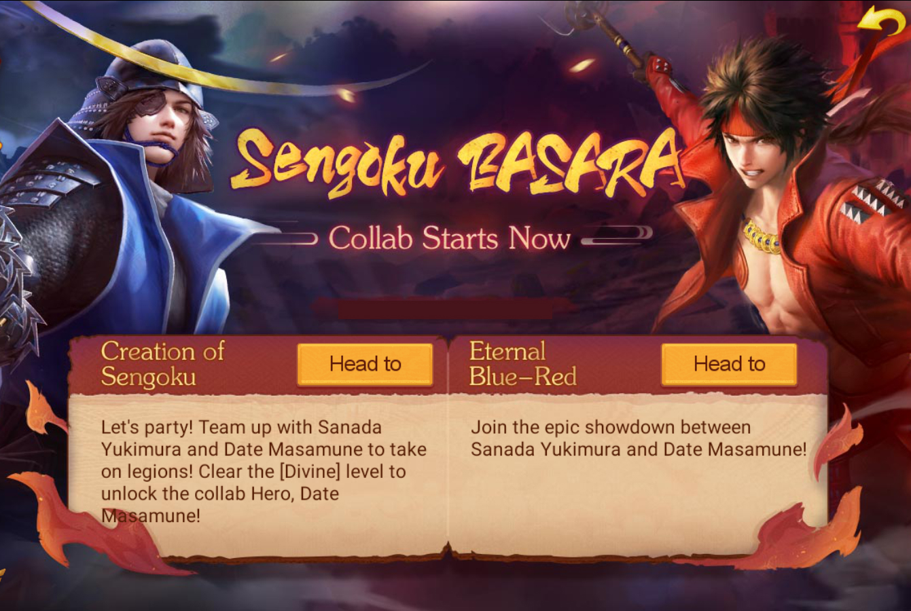

title:: Update Notes ver.1.10.12000
language:: [[en]]
category:: [[Update]]

- #+BEGIN_QUOTE
  Patch: Ver.1.10.12000
  Available: 6:30AM UTC on [[Jun 27th, 2024]] 
  #+END_QUOTE
- {:height 489, :width 715}
- Sengoku BASARA × Sengoku Fubu Collaboration!
	- Event Time: [[Jun 28th, 2024]] 3AM GMT - [[Jul 26th, 2024]] 2:59PM GMT
	- Fight alongside Sanada Yukimura and Date Masamune to challenge countless enemies with the power of two! Clear Creation of Sengoku [Divine] difficulty to obtain the collaboration Hero: Date Masamune!
	- During the event, log in daily to get one free 5-draw in Advanced Recruitment, with 5 opportunities (25 draws in total).
	- During the event, log in daily to receive 10 Past Recruit Tokens via mail (usable in the [[Glorious Past Recruit]]), accumulating over 10 days (100 draws in total).
- 7-Day Login Bonus
	- Log in for a total of seven days during the event to receive exclusive collaboration rewards such as the Seal Crest Flag and an SSR Hero Pack.
- Collaboration Packs
	- Coin Fever Pack: Coin Fever Avatar Frame ×1, choose 2 out of 3 (Advanced Recruitment Token ×3, White Flag ×3, Silver Chogin ×300000).
	- Oshu Hitto Pack: Oshu Hitto Lord Image ×1, Orange Gear Pack ×8, choose 3 out of 5 (Unique Hero Pack ×1, Shadow Token ×4, Corundum ×20, Gorin Book ×20, Gorin Log ×80).
	- Spear of Divine Rule Pack: Spear of Divine Rule Lord Image ×1, choose 3 out of 5 (Little Pony ×2, Jamasakura ×10, Merit Chest ×200, SSR Hero Pack ×2, Orange Exclusive Weapon Pack ×1).
- Sengoku BASARA Collaboration Limited Heroes Recruitment Event
	- First Phase: [[Jun 28th, 2024]] 3AM GMT - [[Jul 12th, 2024]] 3AM GMT
	- SSR [[Sanada Yukimura, Sengoku BASARA Collaboration]]
	  SSR [[Tokugawa Ieyasu, Sengoku BASARA Collaboration]]
	- During the event period, each recruitment in the collaboration limited Hero event grants 1 event Point, which can be exchanged for collaboration limited Heroes and their Exclusive Weapons in the first phase [Exchange Shop]. Please be mindful of the event end time and exchange rewards promptly.
	- Second Phase: [[Jul 12th, 2024]] 3AM GMT - [[Jul 26th, 2024]] 2:59PM GMT
	- SSR [[Ishida Mitsunari, Sengoku BASARA Collaboration]]
	  SSR [[Katakura Kojuro, Sengoku BASARA Collaboration]]
	- During the event period, each recruitment in the collaboration limited hero event grants 1 Lucky Coin, which can be exchanged for collaboration limited Heroes and their Exclusive Weapons in the second phase [Exchange Shop]. Please be mindful of the event end time and exchange rewards promptly.
- Creation of Sengoku
	- Event Time: [[Jun 28th, 2024]] 3AM GMT - [[Jul 11th, 2024]] 2:59PM GMT
	- This solo challenge allows players to team up with their own Hero and an event Hero.
	- Each entry costs 1 ticket. Abandoning mid-game forfeits any rewards and the ticket.
	- You can exit and resume the event at any time, even during a battle.
	- Receive 2 free tickets daily; additional tickets can be bought for 30 Koban each.
	- Earn Tenka Medal and event points by participating. Use Tenka Medal to get training items that boost your Heroes’ attributes. Event points can be exchanged for item rewards and will reset after the event.
	- ★For more details, check in-game.
- Eternal Blue-Red
	- Time: [[Jul 12th, 2024]] 3AM GMT - [[Jul 26th, 2024]] 2:59PM GMT
	- During the event, players are randomly assigned to a faction upon entering the Classic map. Help your faction defeat all enemy forces to win.
	- Faction Details
		- Sanada Army: Led by Sanada Yukimura, they start with a buff and grow stronger over time.
		- Date Army: Led by Date Masamune, they start with a buff that turns into a debuff if Katakura Kojuro’s troops are defeated.
		- Katakura Kojuro’s Troops: Start with a buff and gain a powerful buff if Date Masamune’s troops are defeated.
	- Rewards
		- Event rewards include faction rewards and personal rewards.
		- Faction Rewards
			- The game ends when all enemy faction players are eliminated. Winning faction players receive 100 event points, 10 Ghost Amulets. Losing faction players receive 50 event points, 5 Ghost Amulets.
		- Personal Rewards
			- Complete any of the following objectives:
				- First defeat of any faction’s troops (players and hostile NPCs included)
				- First occupation of 10 castles
				- Personal rewards cap at 100 event points, 10 Ghost Amulets
- [[Ukiyo-e]]
	- Ukiyo-e skill optimized
		- Example: Before optimization, activation order: our Ukiyo-e skill, enemy Hero, our Hero.
		- After optimization, possible order: our Ukiyo-e skill, our Hero, enemy Hero.
- [[Weekend Event]]
	- Rule adjustment for obtaining the weekend points limit in [[Martial Conquest]]:
	- Players with the rank of [[Daifu]] will directly receive the maximum weekend event points upon entering the [[Martial Conquest]] map.
- New [[Renowned Hero]]
	- [[Oda Nobunaga, Siege of Inabayama Castle]]
		- New Passive: When troop is below 50%, lifesteal +10%, damage resist +10%.
		- Enhanced Passive: Each time a shield is obtained, lifesteal +5% (up to 3 times), damage resist +10% (up to 3 times).
	- [[Takenaka Hanbei, Siege of Inabayama Castle]]
		- New Passive: After the first release of Ougi Skill, Ougi +1.
		- Enhanced Passive: After the first release of Awakening Skill, Ougi +1, physical damage resist +30%.
- [[Clan Ready]]
	- Hide ordinary members of your clan in the [Clan Merge] interface.
	- If both clans are engaged in an ongoing Clan War during the merge, the merge request will be held until both Clan Wars end, then automatically proceed.
- Other Optimizations
	- When players enter a Classic Match in pairs and encounter a two-player scenario, they will receive an A rating after unified settlement.
	- New levels have been added to the [[Skirmish Havoc]] mini-game.
	- Added a one-click collection feature for Exploit Quest rewards. Players with a Advanced Exploit Token can upgrade to a Premium Exploit Token, receiving the same total rewards as direct purchase.
	- The Pinnacle Arrival event now includes Pinnacle Hero Oda Nobunaga.
	- Optimized the Backpack interface.
	- Added an explanation to the Weapon Blacksmith Furnace: Recafting an Exclusive Weapon returns consumed Priceless Ore, but Essential Ore is not returned.
- New [[Awakenable Exclusive Weapons]]
	- Oda Nobunaga: Mara
	- Takenaka Hanbei: Miraculous Deed