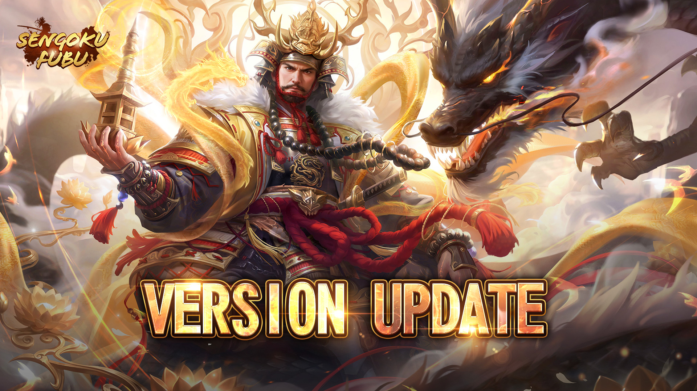
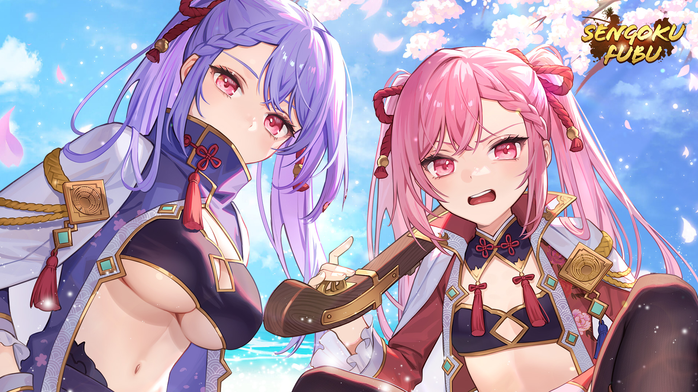

title:: Update Notes ver.1.9.10100
language:: [[en]]
category:: [[Update]]

- #+BEGIN_PINNED
  Patch: Ver.1.9.10100
  Available: 6:30AM UTC on [[Nov 30th, 2023]] 
  #+END_PINNED
- {:height 432, :width 763}
- **What's New**
	- New [[Pinnacle Hero]] has Arrived!
	- {{embed [[Uesugi Kenshin, Bishamonten]]}}
	- New Hero Gear — [[Teaware]]
	- {{embed [[Teaware]]}}
	- New Hero Enhancement — [[Backup Hero]]
	- {{embed [[Backup Hero]]}}
	- New Heroines Come
	- {:height 425, :width 731}
	- {{embed [[Shigehide Hime]]}}
	- {{embed [[Shigetomo Hime]]}}
	- **New Awakenable Exclusive Weapons for More Heroes**
		-
- **Quality of Life Changes**
	- Introduce [[Hero Sharing]] in [[Clan War]]
	- {{embed [[Hero Sharing]]}}
	- Button for [[Pinnacle Quest]] will be removed after you have completed all of them.
	- Optimized Passive Skill display for [[Pinnacle Hero]] and [[Renowned Hero]].
	- Added search function for Hero Collection, Hero Album, and Hero Queue.
	- Added no Kanpaku ascends option in [[Tenka Fubu]] Betting.
	- Increased earned points by completing specific actions in [[Weekend Event]].
- **Other Fixes and Optimizations**
	- [[Clan]]
		- Now a Clan can have 2 Successors.
		- The Daimyo must select a Successor when Abdicating if there are 2 Successors in the Clan.
		- Added sending mail to all members function for updating the Clan Announcement.
	- [[Martial Conquest]]
		- Players at title [[Daifu]] and title hasn’t been changed during last 21 days can form an Alliance team.
		- War starting time has been changed to 4AM GMT from 0AM GMT.
	- [[Majesty Area]] battle starts time: The provided battle start times are estimations; actual times depend on entry to the battlefield.
	- [[Classic Match]]: Increase the action cap per round from 80 to 100, with a mandatory settlement of round buffs upon reaching this limit before proceeding to the next round.
	- Optimized Quick Update button display issue.
	- Add to blocklist can choose to block all channel message from this player now.
	- Optimized notes regarding Shadow Token.
	- Added Arms requirement for [[March On Kyoto]].
	- Optimized display for the Hero profile screen for different resolution.
	- Resolved the display issue in the [[Darkfighter]] Promotion stage: if a title's match is completed ahead of time, a display issue occurs.
	- Resolved the issue of non-functional extra attributes for certain Troop Gears: Like Quartet Bow's Damage dealt to Cavalry +80%.