title:: Update Notes ver.1.9.10200

- #+BEGIN_PINNED
  Patch: Ver.1.9.10200
  Available: 6:30AM UTC on [[Dec 21st, 2023]] 
  #+END_PINNED
- **What's New**
	- [[2023 Christmas Festival]]
		- Event Time: [[Dec 25th, 2023]] 1AM UTC - [[Jan 13th, 2024]] 2:59 PM UTC
		- [[7-Day Login Bonus]]
			- {:height 383, :width 617}
		- [[2023 Christmas Recruitment]]
			- 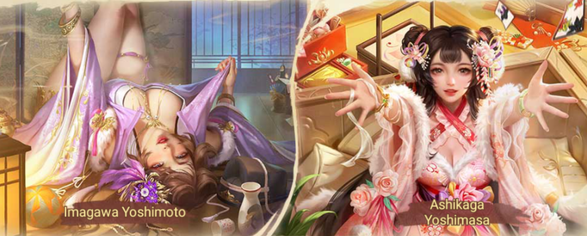{:height 347, :width 840}
			- 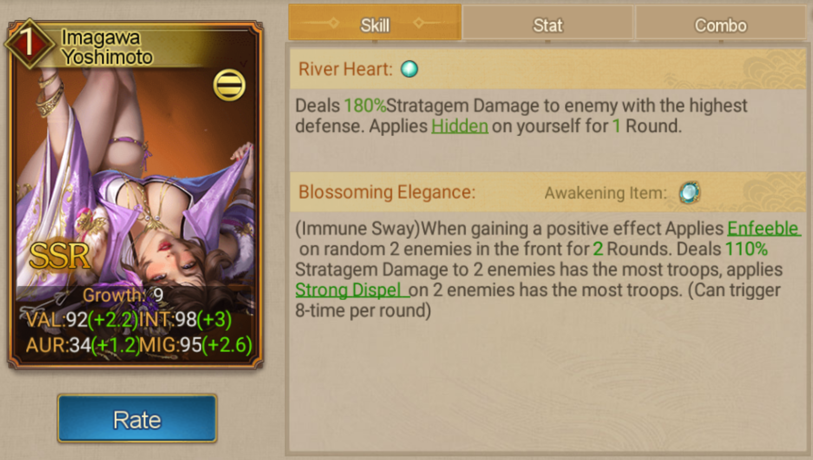{:height 390, :width 664}
			- 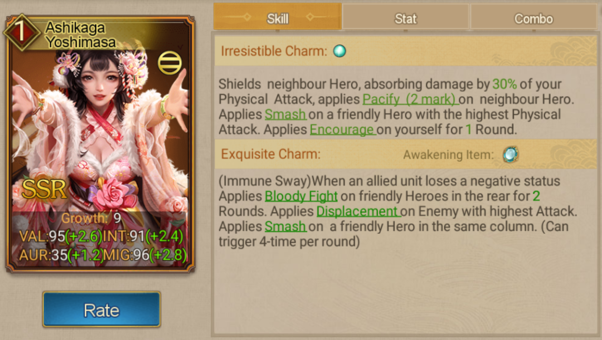{:height 390, :width 664}
		- [[Christmas Pack]]
			- {:height 285, :width 680}
			- 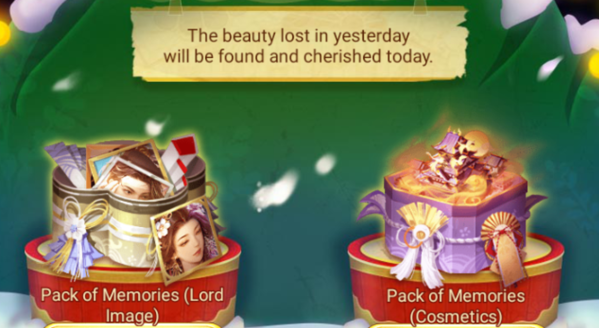{:height 370, :width 680}
		- [[Melody of Blossom]]
			- 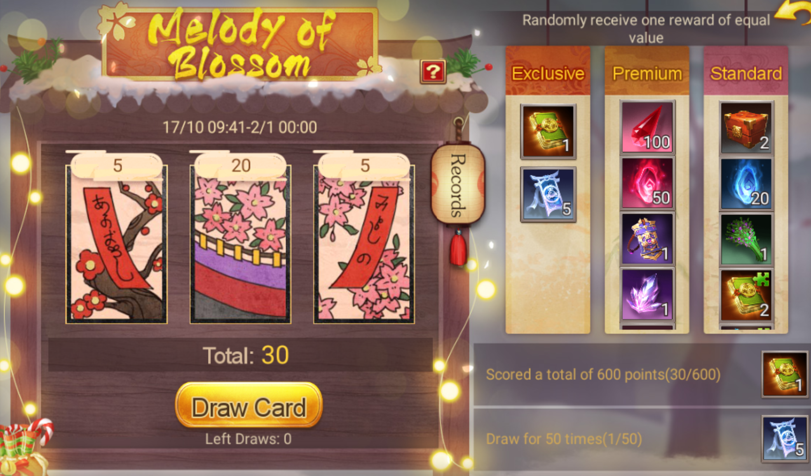{:height 385, :width 628}
		- [[Christmas Wheel]]
			- 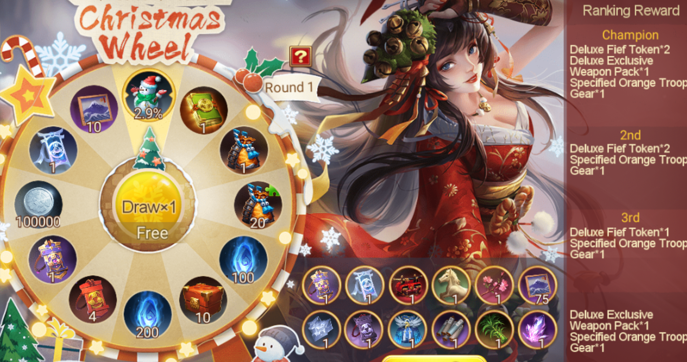{:height 342, :width 627}
		- [[Snowy Plum Blossom]]
			- 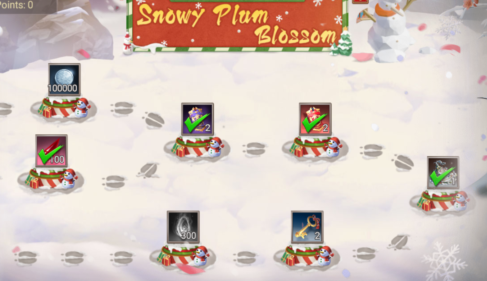{:height 364, :width 624}
		- New Game Mode [[One Night Castle]]
		- {{embed [[One Night Castle]]}}
	- New [[Renowned Hero]]
		- {{embed [[Maeda Toshiie]]}}
		- {{embed [[Sarutobi Sasuke]]}}
	-
	- **New Awakenable Exclusive Weapons for More Heroes**
		- [[Yanagisawa Yoshiyasu]]
		- [[Miura Anjin]]
		- [[Kato Kiyomasa]]
		- [[Tachibana Muneshige]]
- **Quality of Life Changes**
	- [[Backup Hero]]
		- Added button to filter Backup Heroes in Hero collection.
			- 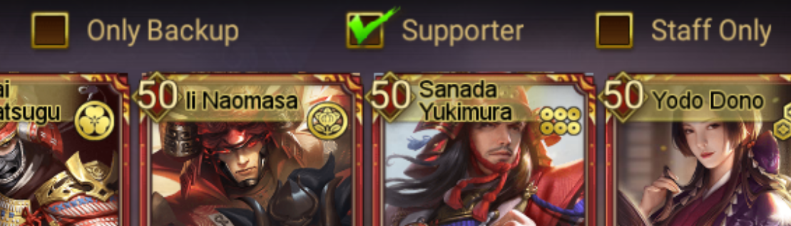{:height 167, :width 604}
		- Fixed the issue that [[Staff]] can be Backup Heroes.
		- Added Hero filter and search function.
	- [[Clan]]
		- You can specify a reason when denying a Clan application.
		- New feature: Clan Deployment Management.
			- Clan leaders can now adjust member deployment priorities for building tasks.
			- 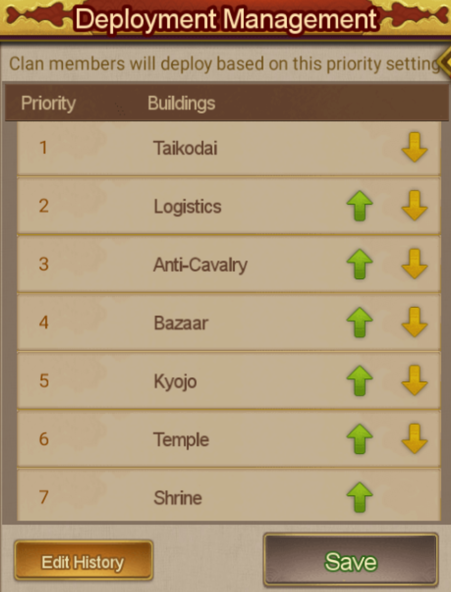{:height 453, :width 336}
		- Channels for uniting Clans: Players can now merge two Clans through the [[Clan Ready]] event.
	- Optimized [[Stratagem]] using in Backpack.
		- 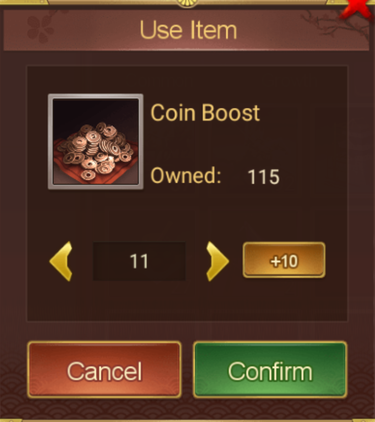{:height 314, :width 265}
	- Optimized Notes of Crit. Crit can't be dodged or parried.
		- 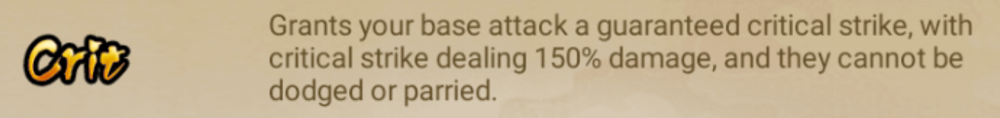{:height 87, :width 617}
	- Improved battle speed bar positioning
	- Staff skill interface updates
		- Skill refresh button has been updated to "Replace."
		- Confirmation prompt added when exiting the skill refresh screen.
	- [[Soul of Pinnacle]]
		- You can't exchange for Peak Souls of Pinnacle of Hero you don't own. Souls exchange are unlimited, with a single transaction cap of 900.
	- Expand your friends list with 5 customizable groups now available.
		- 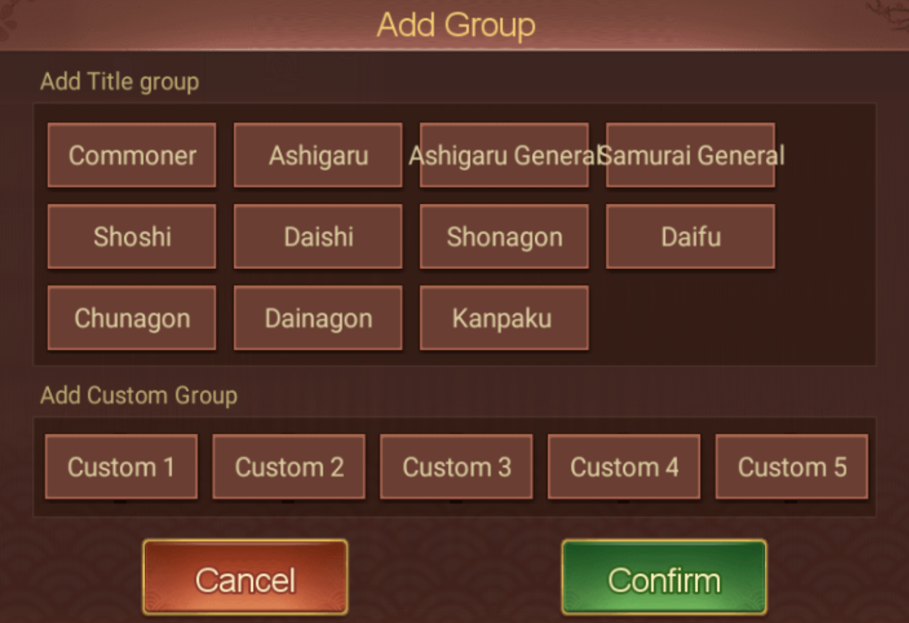{:height 382, :width 520}
	- Gift pack navigation is streamlined with better categorization.
		- {:height 327, :width 55}
	- Pinnacle Hero packs can now be found in the recruitment section.
		- 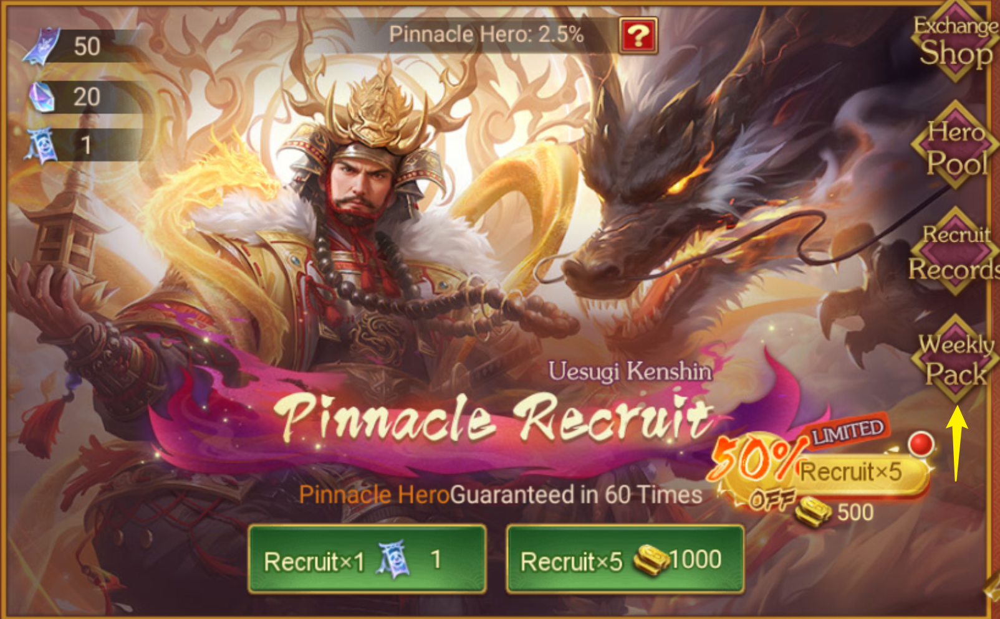{:height 329, :width 610}