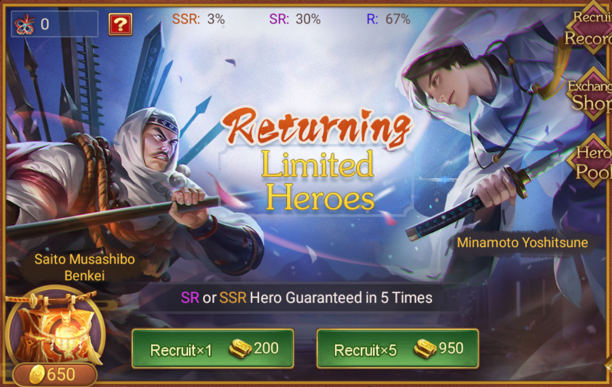
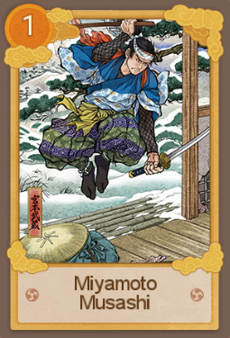
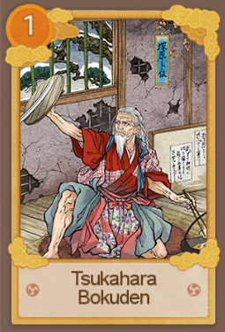
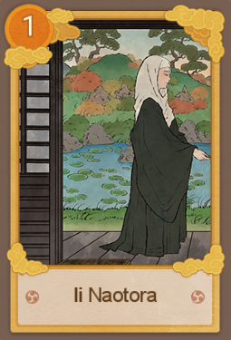
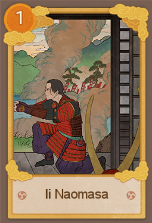
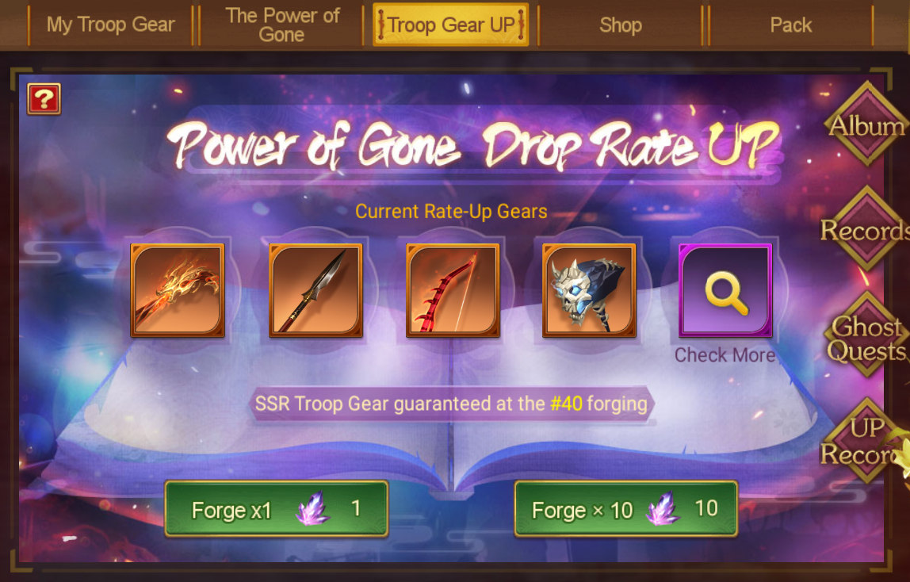
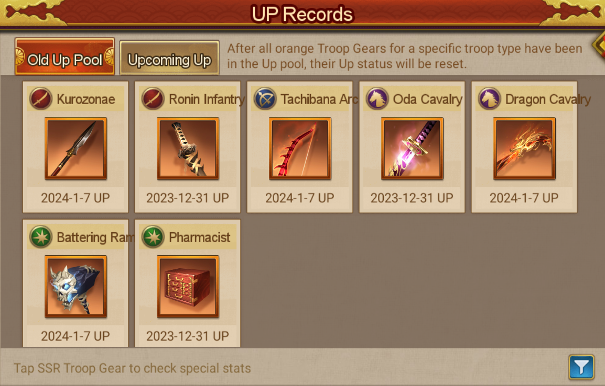

title:: Update Notes ver.1.9.10300
language:: [[en]]
category:: [[Update]]

- #+BEGIN_PINNED
  Patch: Ver.1.9.10300
  Available: 6:30AM UTC on [[Jan 11th, 2024]] 
  #+END_PINNED
- **What's New**
- Rashomon S9 is Coming!
- {{embed [[Rashomon S9 The Elite Four of Takeda]]}}
- New Pinnacle Hero {{embed [[Sanada Yukimura, Six Panths Divine Jizo]] }}
- New Season for Pass of Defiance {{embed [[Pass of Defiance S19]]}}
- {{embed [[Returning Heroes Limited Edition]]}}
- {:height 475, :width 737}
- New [[Ukiyo-e]]
	- Miyamoto Musashi and Tsukahara Bokuden
		-  
		- Base Stats: Increase [[Physical Attack]] and [[Stratagem Attack]]
		- Combo: Increase Puncture and Skill Crit
			- | Level | Puncture | Skill Crit |
			  | --- | --- | --- |
			  | 1 | 6% | 2% |
			  | 2 | 12% | 4% |
			  | 3 | 18% | 6% |
			  | 4 | 24% | 8% |
			  | 5 | 30% | 10% |
	- Ii Naotora and Ii Naomasa
		-  
		- Base Stats: Increase [[Physical Attack]] and [[Stratagem Attack]]
		- Combo: Increase Damage done when the target is shielded
			- | Level | Percent |
			  | --- | --- |
			  | 1 | 10% |
			  | 2 | 20% |
			  | 3 | 30% |
			  | 4 | 40% |
			  | 5 | 50% |
- New [[Troop Gear]]
- New [[Awakenable Exclusive Weapons]]
- **Quality of Life Changes**
	- The interface for editing [[Ukiyo-e]] teams in team formation has been improved.
	- Awards records feature has been added to the [[Skeletal Abyss]].
	- A new page for tracking chance Up [[Troop Gear]] has been introduced in the [[Troop Gear Up]].
		- {:height 404, :width 641}  {:height 428, :width 643}
	- The system for claiming rewards from the [[Weekend Event]] after accomplishing certain criteria has been optimized.
		- Each weekend event includes random challenge quests. Every weekend event will now present a random challenge task upon entry, completion of which will reward you with additional weekend points up to a set maximum.
		- After taking on enough challenge quests during a certain weekend event, players can automatically receive the full amount of the current week's maximum weekend points the next time the same event occurs, even without participating.
	- The event shop in the [[One Night Castle]] now supports batch exchanges.
- **Other Fixes and Optimizations**
	- Resolved the issue where a Hero could equip multiple [[Supporter]] and their attributes would function correctly. Now, if a Hero is equipped with more than two Supporters, the attributes of all these Supporters will be deactivated.
	- Resolved the issue where Kinoshita Tokichiro's awakening skill could trigger itself following a awakening skill critical strike.