public:: true
title:: Update Notes ver.1.9.9800
language:: [[en]]
category:: [[Update]]

- #+BEGIN_PINNED
  Patch: Ver.1.9.9800
  Available: 6:30AM UTC on [[Sep 21st, 2023]]
  #+END_PINNED
- **What's New**
	- New [[Main Storyline]] Chapter 20
	  collapsed:: true
		- 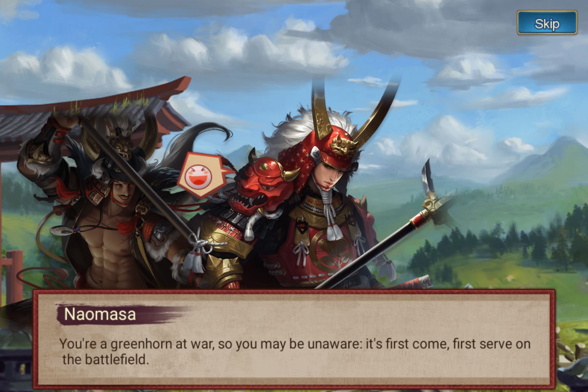{:height 390, :width 580}
		- Complete Stage 4 to obtain Hero SR [[Ii Toramatsu]]
			- 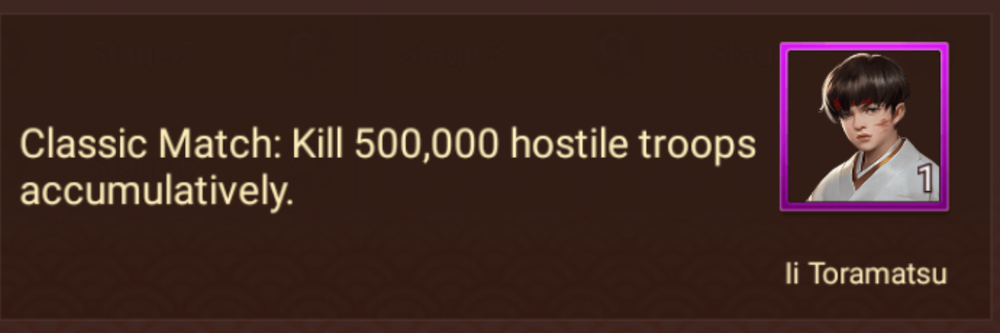{:height 189, :width 551}
	- New Event [[Martial Conquest]]
	  collapsed:: true
		- Eligibility: Title [[Daifu]]
		- Same event with [[Tenka Fubu]] but for title Daifu.
		- *Players have joined [[Martial Conquest]] and its pre-event [[Fame War]] can't join [[Tenka Fubu]] in 30 days. But can still participate in [[Tenka Fubu]] as [[Ronin]].*
		- Difference with [[Tenka Fubu]]
			- No [[Betting]] event, [[Charts]], [[Ronin]] gameplay, and [[Accession Ceremony]]
			- The winner of [[Martial Conquest]] can't establish [[Clan]].
	- New Available Heroes for [[Renowned Hero Path]]
	  collapsed:: true
		- [[Toyotomi Hideyoshi]]
			- 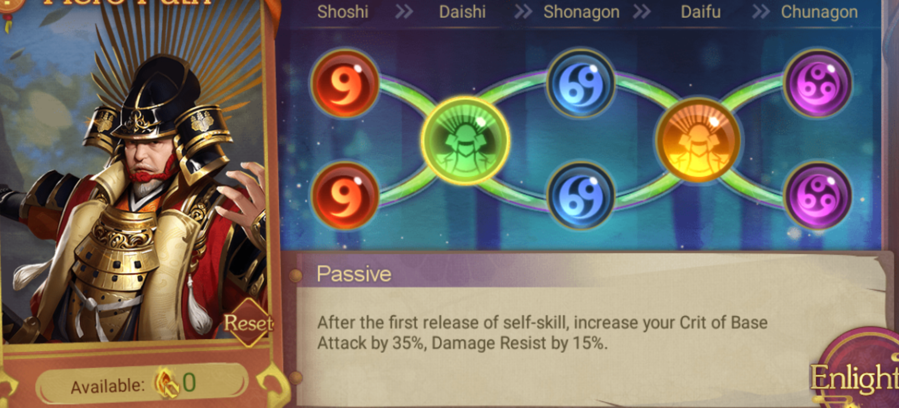{:height 417, :width 758}
			- 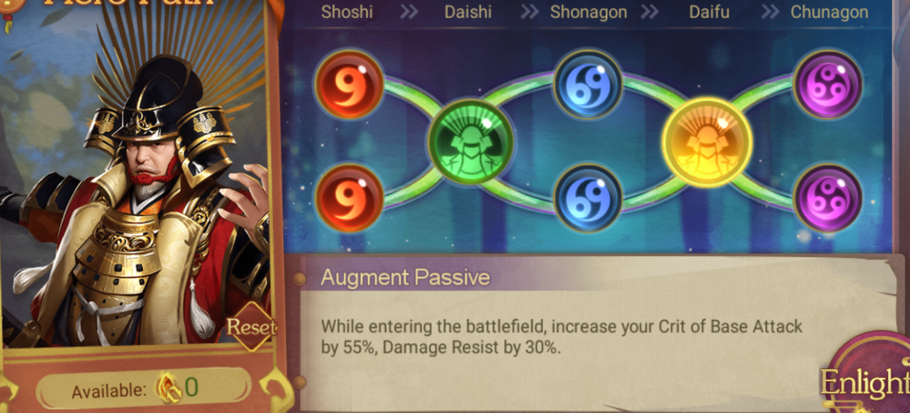{:height 417, :width 758}
		- [[Saitou Dousan, Mino Usurper]]
			- 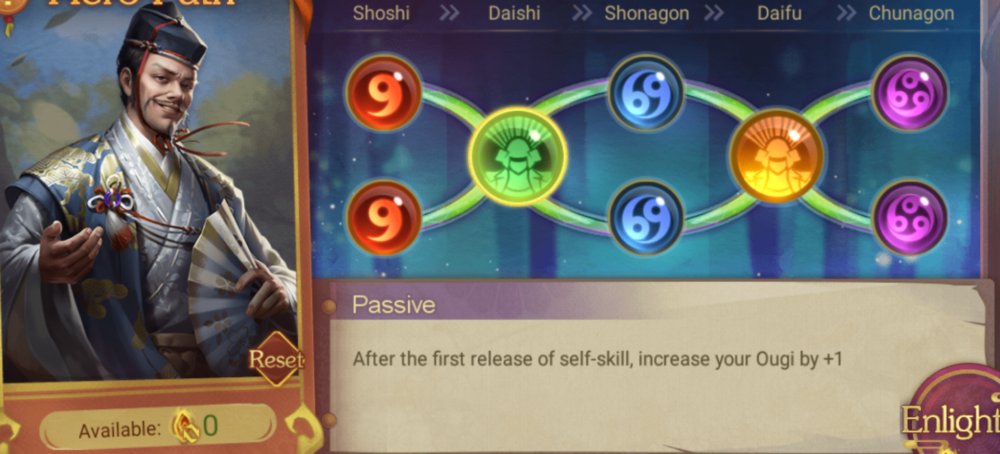{:height 417, :width 758}
			- 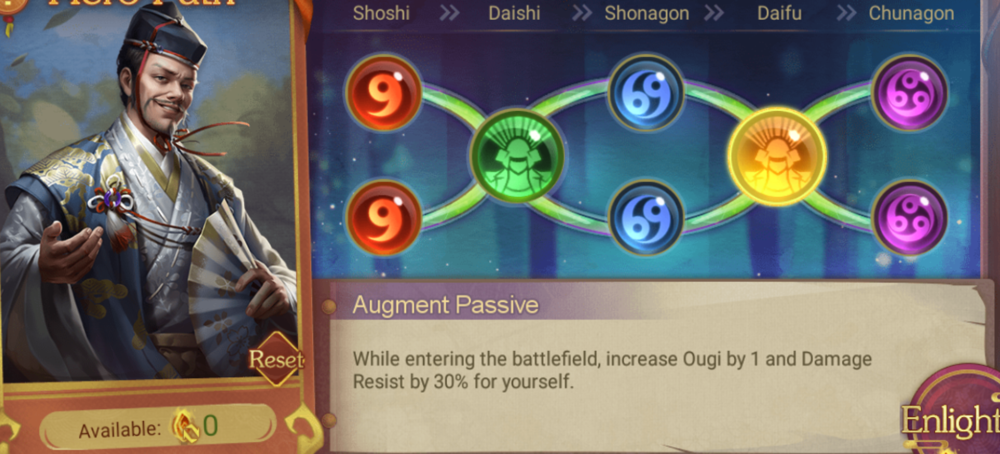{:height 417, :width 758}
	- New [[Ukiyo-e]]
	  collapsed:: true
		- [[Tamamo Mae]], [[Killing Stone]]
			- Base Stats: [[Physical Defense]] +28, [[Stratagem Defense]] +28
			- Combo: Increase [[Resistance]]
				- 6%
				- 12%
				- 18%
				- 24%
				- 30%
			- 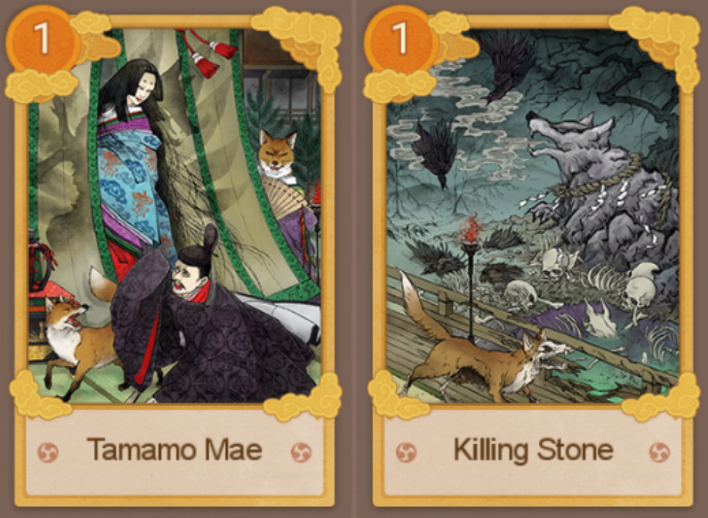{:height 328, :width 408}
		- [[Dragon Palace]], [[Urashima Taro]]
			- Base Stats: Increase [[Physical Defense]] and [[Stratagem Defense]]
			- Combo: Takes less damage from enemies in the same column
				- 8%
				- 16%
				- 24%
				- 32%
				- 40%
			- 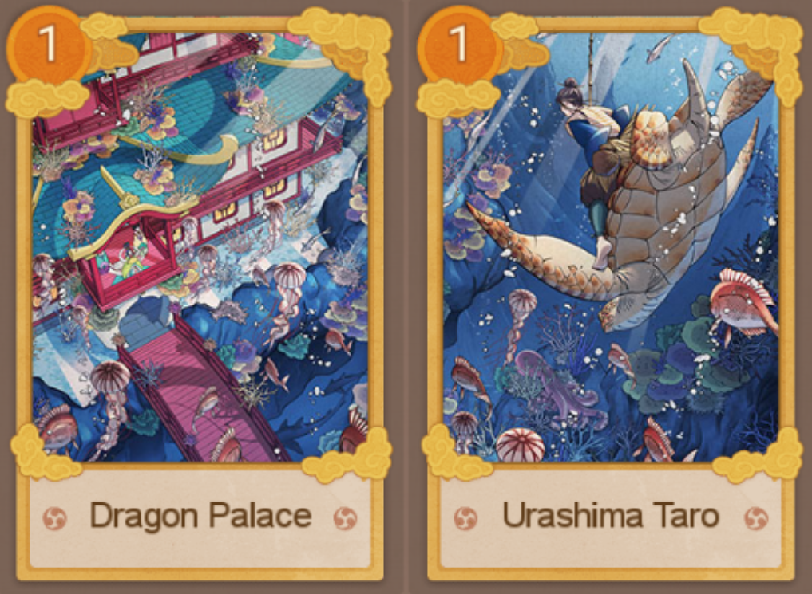{:height 328, :width 408}
		- [[Oda Nobunaga]], [[Imagawa Yoshimoto]]
			- Base Stats: Increase [[Physical Defense]] and [[Stratagem Defense]]
			- Combo: (Double the special stat when affected by Sway, Seal, Silence) Increase [[Physical Damage]]
				- 3%
				- 6%
				- 9%
				- 12%
				- 15%
			- 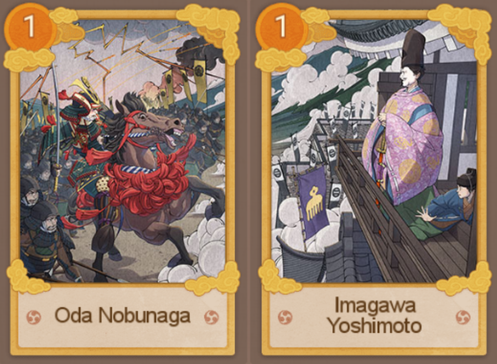{:height 328, :width 408}
	- New Awakenable Exclusive Weapons for More Heroes
	  collapsed:: true
		- [[Princess Gou]]
			- 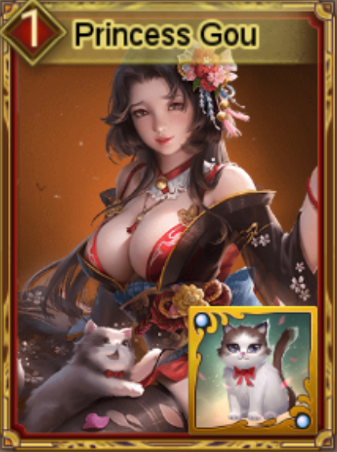{:height 294, :width 187}
			- 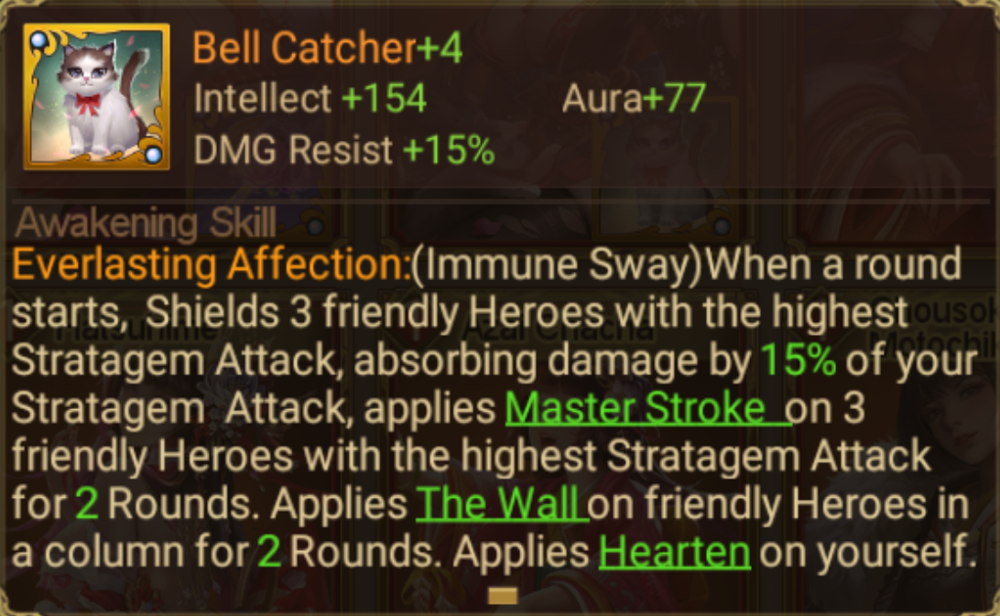{:height 347, :width 587}
			- 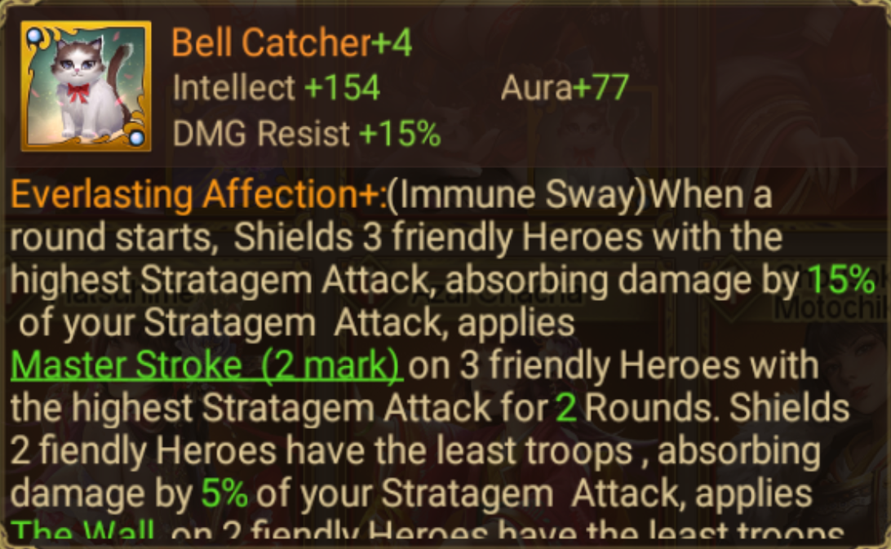{:height 347, :width 587}
			- 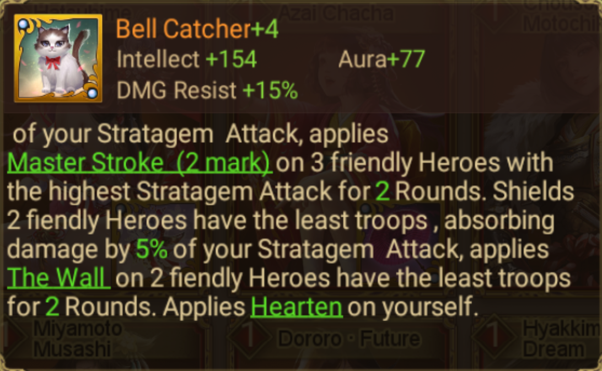{:height 347, :width 587}
		- [[Hatsuhime]]
			- 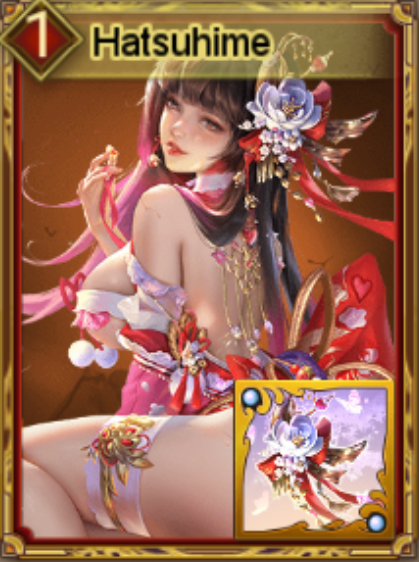{:height 294, :width 187}
			- 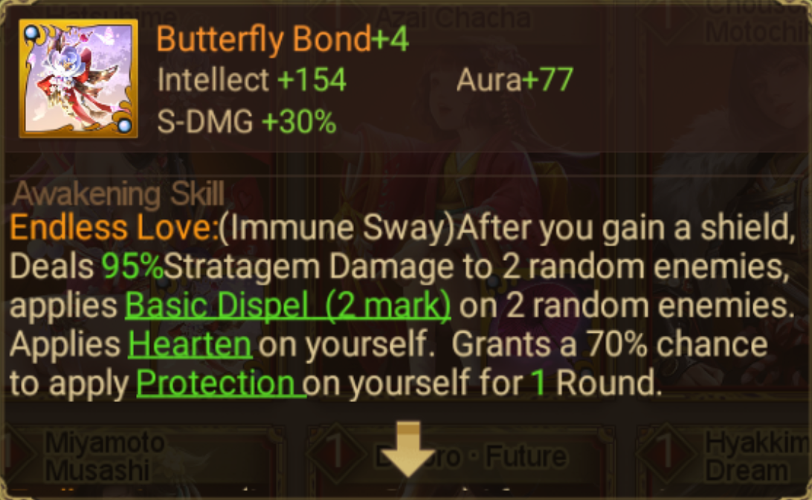{:height 347, :width 587}
			- 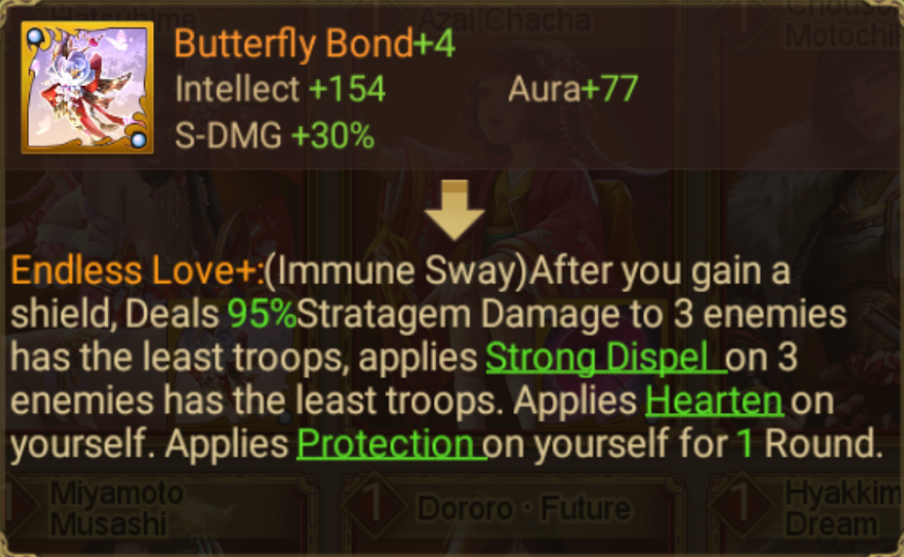{:height 347, :width 587}
	- New Heroes Added in [[Glorious Past Recruit]]
	  collapsed:: true
		- [[Classic SSR Hero]]
			- [[Chiyo Hime]]
			- [[Tokugawa Masako]]
			- [[Yagyu Hyogonosuke]]
			- [[Ota Dokan]]
			- [[Okumura Sukezaemon]]
			- [[Asakura Yoshikage]]
			- [[Yamagata Masakage]]
			- [[Akechi Hidemitsu]]
			- [[Sakai Tadatsugu]]
			- [[Shimazu Iehisa]]
			- [[Konya Takao]]
			- [[Ogyu Sorai]]
			- [[Marume Nagayoshi]]
		- [[Unique Hero]]
			- [[Miyamoto Musashi, Duel at Ganryu Island]]
			- [[Sasaki Kojiro, Duel at Ganryu Island]]
			- [[Akechi Hidemitsu, Samasuke's Lake Crossing]]
			- [[Yamauchi Kenshouin, The Good Wife]]
			- [[Otani Yoshitsugu, The Last Fight]]
			- [[Uesugi Kenshin, Youthful Ambition]]
- **Quality of Life Changes**
	- Added countdown and notes for [[March On Kyoto]].
	  collapsed:: true
		- If the main general of Imagawa army reaches [[Washizu]] or the main general of the Oda army defeats the main general of the Imagawa, the game will end prematurely.
		- 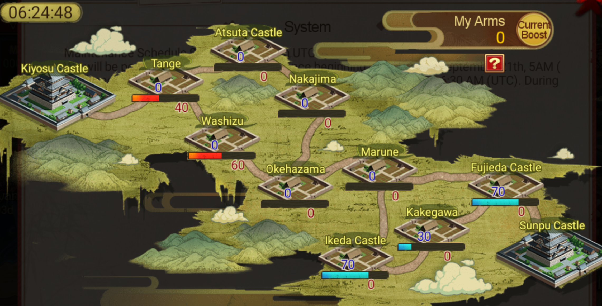{:height 429, :width 851}
	- [[Exclusive Weapon]]
	  collapsed:: true
		- The unpossessed Exclusive Weapon now includes a lock marker, indicating that the said weapon has not yet been obtained.
		- 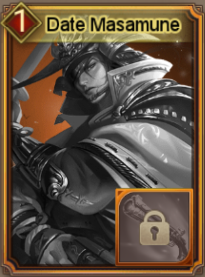{:height 233, :width 198}
	- [[Hero Skill]] Description
	  collapsed:: true
		- [[Ougi Skill]] still referred to as Skill in some [[Awakening Skill]] description will be unified and classified as Ougi Skill.
- **Other Fixes and Optimizations**
	- Adjustment of Hero Names
	  collapsed:: true
		- [[Kosaka Masanobu]] changed to [[Kosaka Masanobu · R]]
		- [[Niwa Nagahide]] changed to [[Niwa Nagamasa · SR]]
		- [[Goto Mototsugu]] changed to [[Goto Mototsugu · SR]]
	- Adjustment of [[Hojo Soun]]'s Awakening Quest
	  collapsed:: true
		- In Classic Match, the number of enemy Heroes defeated by Hojo Soun reaches 90.
		- (Was) In Classic Match, the total number of critical strike performed by Hojo Soun reaches 225.
	- [[Ghostship to Rumble]]
	  collapsed:: true
		- Bo-hiya will be kept after the end of event.
		- Rewards and the price of Bo-hiya has been adjusted.
		- 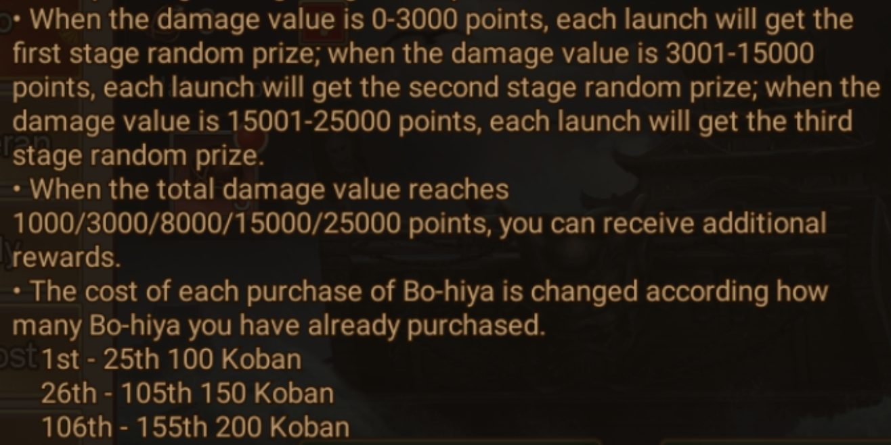{:height 468, :width 779}
	- [[Horse Racing]]
	  collapsed:: true
		- The frequency of the event shall be adjusted to a bi-monthly basis, taking effect in the subsequent calendar month.
		- The rewards shall be subject to revision. For more details, kindly refer to the information available within the game.
	- [[Gearsmith]]
	  collapsed:: true
		- The frequency of the event shall be adjusted to a bi-monthly basis, taking effect in the subsequent calendar month.
		- The enhancement chances and price shall be subject to revision. For more details, kindly refer to the information available within the game.
		- The user interface has been enhanced by including a prominent label for this event (which displays when the event is available).
	- Fixed the Hero Skill description for [[Matsudaira Motoyasu, March On Kyoto]].
	- Fixed the Hero faction issue in [[Glorious Past Recruit]].