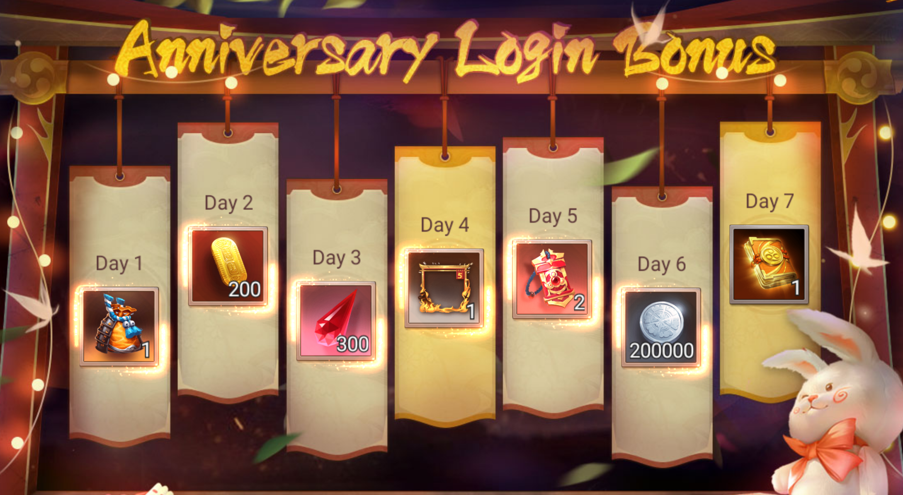
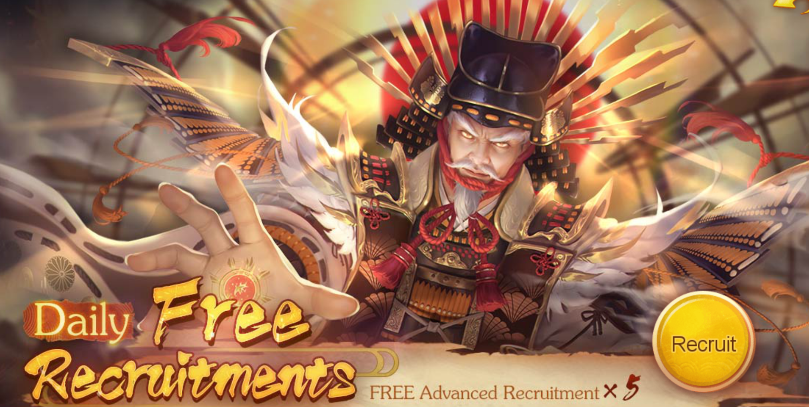
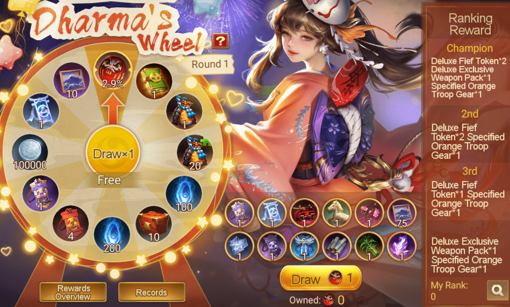
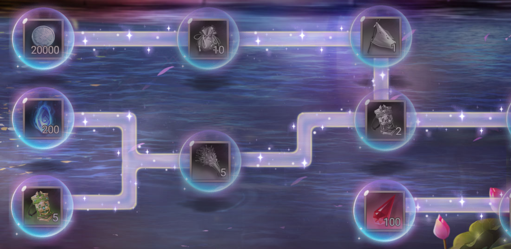
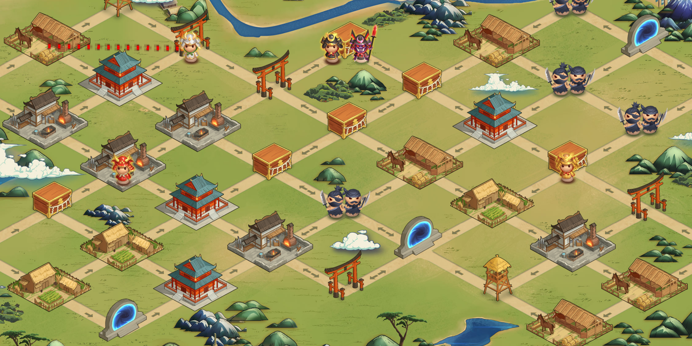

public:: true
title:: Update Notes ver.1.9.9900
language:: [[en]]
category:: [[Update]]

- #+BEGIN_PINNED
  Patch: Ver.1.9.9900
  Available: 6:30AM UTC on [[Oct 19th, 2023]] 
  #+END_PINNED
- {:height 496, :width 733}
- **What's New**
	- **New Pinnacle Hero [[Oda Nobunaga, Tenka Fubu]]**
		- Release Date: [[Oct 19th, 2023]]
		- Ougi Skill — Douse Wars with Wars
			- Cost: 2 Ougi
		- Awakening Skill — Journey of Compassion
	- **Sengoku Fubu 5 Years Anniversary**
		- [[7-Day Login Bonus]]
			- {:height 516, :width 809}
		- [[Daily Free Recruitments]]
			- {:height 333, :width 733}
		- [[Limited Recruit]]
		- [[Dharma's Wheel]]
			- {:height 434, :width 747}
		- [[Melody of Blossom]]
		- [[Path of Extravaganza]]
			- {:height 257, :width 744}
		- [[Anniversary Pack]]
		- New Boardgame — [[Clash at Mt.Tenno]]
			- {:height 481, :width 914}
	- **New Awakenable Exclusive Weapons for More Heroes**
		- [[Kato Kiyomasa]]	, [[Katakama Jumonji]]
		- [[Yui Shosetsu]], [[Shosetsu Muramasa]]
		- [[Narita Nagachika]], [[Nagachika Nakiri]]
		- [[Mogami Yoshiaki]]	, [[Mutsu Otenta]]
- **Quality of Life Changes**
	- [[Weekend Event]]
		- [[Puppet Shogi]]
		- Refine [[Sanada Maru]] event scoring system
			- a. When calculating for the last time, points gained for occupying your own city: 100 (previously 200), capped at 2000 (previously 4000).
			- b. (New) For every castle attack battle victory in a match: 200, capped at 3000.
		- Adjustments to the [[Weekend Event Shop]]
			- a. Raise the weekend points upper limit for each title.
				- | Warzone | Original Weekly Limit | After Upgrade Limit |
				  | --------------------- | --------------------- | ------------------- |
				  | Growth Area   | 6000                  | 7000                |
				  | Rank-up Area | 7000                  | 8000                |
				  | Veteran Area   | 9000                  | 10000               |
				  | Master Area   | 11000                 | 12500               |
				  | Grandmaster Area | 13000               | 15000               |
				  | Divinity Area | 15000                 | 18000               |
				  | Majesty Area | 15000                 | 20000               |
			- b. The weekend shop now includes additional redeemable items.
	- [[Clan]]
		- Add new building [[Shrine]] for Clan
			- The [[Shrine]] provides an attack boost during map [[Clan War]].
- **Other Fixes and Optimizations**
	- The [[Renowned Hero Shop]] now includes a list of available Renowned Heroes.
	- Daifu (Divinity Area), Chunagon, Dainagon (Majesty Area): The potential war commencement time is displayed before player matching.
	- An additional battle at 22:00 (GMT+8) has been introduced in the Majesty Area.
	- During Clan War, the breakthru status is shown when the Clan elder checks a player's info.